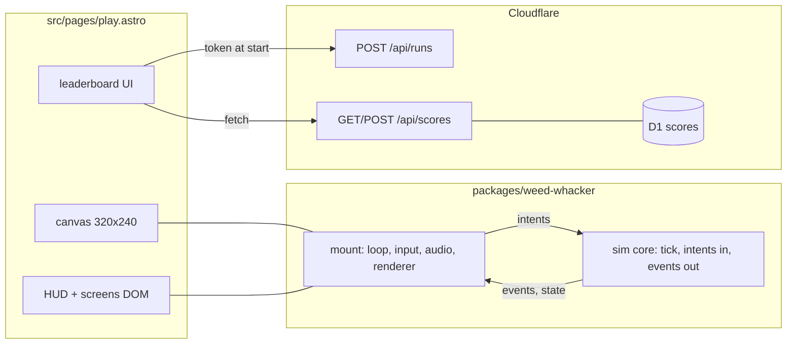

# feat: Weed Whacker web v1 with leaderboard

## Overview

Port the Weed Whacker game (Python/Pygame prototype at ~/Documents/weed-whacker)
to a TypeScript/Canvas browser game hosted at `/play` on itshagennothagen.dev,
with a global top-10 leaderboard backed by Cloudflare Pages Functions and D1.
The game lives in an npm workspace package with a pure headless sim core so
future targets (tools, weather, desktop/Steam wrapper) extend it rather than
rewrite it. Delivered as three PRs.

## Problem Frame

The game exists only as an unfinished desktop Python prototype nobody can play.
Goal: playable v1 in the browser with a shared leaderboard, built on boundaries
that keep the sim testable and portable (see origin:
docs/brainstorms/2026-07-03-001-weed-whacker-web-v1-requirements.md). The
TypeScript port becomes the canonical game; the Python code is reference
material.

## Requirements Trace

From the origin document:

- R1. Playable at `/play`, card on the Lab page (Units 7, 10)
- R2. 3-minute timed run, countdown HUD, end screen with submit form and play
  again (Units 3, 7, 10)
- R3. Core mechanics match the original: 7x7 fully-visible world (revised from
  30x30 after playtest, see docs/reviews/2026-07-03-002), random connected
  9-tile start plot, tile movement (150 ms cooldown), chop (1000 ms cooldown,
  hand hoe), $1/sec per clear grass tile, adjacent tile purchase at $10 + $5 per
  tile bought (Units 2, 3)
- R4. Weed spawn scales with owned grass tiles, constants in one config (Unit 3)
- R5. Score = weeds whacked, live in HUD (Units 3, 7)
- R6. Global top-10 leaderboard, 20-char names, server-side validation, rate
  limiting (Units 8, 9, 10)
- R7. SFX: chop wav, purchase, timer warning, run end; mute toggle; no music
  (Unit 6)
- R8. Original sprites at 64 px tiles, whole 7x7 board visible (no camera,
  revised after playtest), integer 1:1 canvas scaling (Units 4, 5)
- R9. Desktop keyboard; touch devices get a "best with keyboard" note (Units
  5, 7)

## Scope Boundaries

Carried from the origin document: no tool shop, no weather events, no weed
regrowth or toughness, no music, no touch controls, no accounts. Anti-cheat is
best-effort; scores are client-reported and forgeable, accepted for a portfolio
toy. Additional planning-time exclusions:

- No pause. A run is 3 uninterrupted wall-clock minutes so leaderboard entries
  stay comparable. Tab-hiding does not stop the clock.
- No profanity filter on names. Names render as text nodes only (no innerHTML),
  which contains the real risk (XSS). Manual deletion via wrangler is the
  moderation path.
- No replay validation. The deterministic seeded core makes it possible later;
  out of scope now.

## Context & Research

### Relevant Code and Patterns

- `src/pages/labs/pokemon-matcher.astro`: the interactive-page pattern to
  follow. Single .astro file, processed (non-inline) script tag with ESM imports
  and full TS, vanilla DOM, no framework islands.
- `src/pages/lab.astro`: `tools` array registry for lab cards.
- `src/layouts/Base.astro`: page shell, `title`/`description` props.
- `src/styles/global.css`: theme tokens in `:root`, mapped in `@theme`. Tailwind
  `@source` only scans `src/**/*.astro`, so utility classes used inside package
  TS will not generate. All styled markup stays in the .astro page; canvas draws
  everything else.
- Python reference: `~/Documents/weed-whacker/weed_whacker/src/game/` (grid.py,
  player.py, economy.py, weeds.py, tools.py) and `config.py`. Port the mechanics
  and constant names, not the structure.

### Repo Constraints Discovered

- Root `tsconfig.json` has `include: ["**/*"]`, so `astro check` would sweep
  `packages/` and `functions/` at strict settings. Resolution: exclude both from
  the root tsconfig; each gets its own tsconfig plus its own typecheck step
  (Unit 1).
- CI (`.github/workflows/ci.yml`) runs prettier check, `astro check`, build, and
  codespell (src/content only). No test step exists; Unit 1 adds one, or package
  tests never run.
- Prettier (`.prettierrc.json`: no semicolons, single quotes) covers all new
  directories; `prettier --check .` runs from root.
- `overrides: { "vite": "^7.3.2" }` in package.json; Vitest 4.x requires Vite >=
  6, compatible.
- Node 22 pinned via `.nvmrc`; npm with root lockfile. Adding `workspaces`
  rewrites `package-lock.json` once.

### Institutional Learnings

- No `docs/solutions/` knowledge base exists. Cloudflare Pages project is named
  `itshagennothagen` (docs/side-quests/2026-06-20-001).

### External References

- Pages Functions on static Astro: repo-root `functions/` dir, no adapter
  needed; file routing (`functions/api/scores.ts` -> `/api/scores`); TS out of
  the box. Types via `npx wrangler types` (the `@cloudflare/workers-types`
  package is deprecated).
  https://developers.cloudflare.com/pages/functions/get-started/
- Pages is in maintenance but supported; Workers migration is explicitly not
  needed and Pages keeps free per-PR preview environments. Stay.
- wrangler.toml for Pages: `pages_build_output_dir` marks it; once deployed, the
  file becomes the source of truth and those settings go read-only in the
  dashboard (one-way door, flagged in ops notes). Preview deployments inherit
  production bindings unless `[env.preview]` overrides them: without a preview
  database, PR previews write production data.
  https://developers.cloudflare.com/pages/functions/wrangler-configuration/
- Local dev: `astro dev` has no bindings. Functions + D1 verified via
  `astro build && wrangler pages dev dist` (the `--proxy` flag is deprecated).
- npm workspace raw-TS package: Vite treats linked workspace deps as source and
  transforms them; `exports: { ".": "./src/index.ts" }` works for both the page
  script and the Pages Functions esbuild bundler.
  https://vite.dev/guide/dep-pre-bundling
- Game loop: fixed-timestep accumulator with dt handling, no render
  interpolation needed for tile-snap movement (nothing to interpolate).
  https://isaacsukin.com/news/2015/01/detailed-explanation-javascript-game-loops-and-timing
- Crisp pixels: fixed internal resolution canvas, integer CSS scale,
  `imageSmoothingEnabled = false` (re-set after any canvas resize),
  `image-rendering: pixelated`, integer draw coordinates. Accept minor softness
  on fractional-DPR displays.
  https://developer.mozilla.org/en-US/docs/Games/Techniques/Crisp_pixel_art_look
- Input: focusable canvas (`tabindex="0"`), listeners on the canvas so
  preventDefault only applies while the game has focus, `e.code` key set, clear
  held keys on blur.
- Audio: resume AudioContext on first gesture, decode wav once into an
  AudioBuffer, one-shot AudioBufferSourceNodes through a master GainNode, mute =
  gain 0 (never suspend the context). ZzFX-style oscillator synthesis for the
  non-chop SFX (no assets to source).
- `CF-Connecting-IP` is set by Cloudflare on all proxied requests and is not
  client-spoofable. The native rate-limit binding is Workers-only; D1 timestamp
  checks are the accepted Pages pattern.

## Key Technical Decisions

- Headless deterministic sim core: plain TS, zero DOM/canvas/audio imports,
  seeded PRNG (mulberry32) injected, no clock reads. Intents in (discriminated
  unions), events out. Trivially testable in Vitest, upgrade path to replay
  validation (see origin doc).
- Fixed-timestep loop (1000/60 ms step) with accumulator in the shell; sim tick
  granularity keeps 150 ms and 1000 ms cooldowns accurate.
- Wall-clock run timer: on `visibilitychange` back to visible, the shell
  fast-forwards sim ticks bounded by remaining run duration (the sim is cheap; 3
  minutes of ticks is negligible). The normal per-frame dt clamp (250 ms) does
  not apply to the catch-up path.
- Buy input: B key purchases the adjacent unowned tile the player faces,
  matching the original game. Orthogonal adjacency to owned tiles required,
  exact `money >= cost` boundary buys. Failed buy is a no-op with feedback (deny
  sound, HUD flash).
- Chop targeting: player's current tile (hand hoe reach is [(0,0)] in the
  original). Click on the canvas is an alternate trigger for the same action,
  not ranged chopping. Whiff (no weed) consumes no cooldown, matching original
  `try_chop`. Held space auto-repeats at cooldown rate; movement sampled from
  held-key state per tick, last-pressed axis wins.
- Weed spawn model: each clear grass tile has an independent spawn chance per
  second (weeded tiles cannot double-spawn; the player's own tile can spawn).
  Expansion therefore raises both income and score ceiling, the core strategy
  loop. Constants live in one config module mirroring the original config.py.
- Score bound shared, not duplicated: max submittable score derives from config
  (run duration / chop cooldown = 180) and is exported by the package; the API
  function imports it. One tested source of truth.
- Session tokens without storage: POST /api/runs returns an HMAC-signed token
  (issue timestamp + nonce, secret in a Pages env var). Nothing is written at
  run start; submits insert the nonce with a UNIQUE constraint, making tokens
  single-use. Elapsed time is validated server-side only (issue time vs submit
  time, min ~175 s, max 30 min); no client-reported timing is trusted. Token
  wire format is strict (fixed field boundaries, verified via WebCrypto) so
  signed bytes cannot be re-split to shift the effective issue time; details in
  Unit 9.
- Token-optional play: if POST /api/runs fails, the run plays normally and the
  end screen shows "leaderboard unavailable" instead of the form. This same
  conditional is PR2's entire end-screen behavior (no token endpoint exists
  yet), so PR2 ships no dead UI.
- wrangler.toml over dashboard config: bindings reviewable in the repo,
  `[env.preview]` binds a separate preview database so PR previews never write
  production scores.
- Assets served from `public/games/weed-whacker/`; `mount()` receives an asset
  base URL so the package stays free of site-specific paths.
- Multiple tabs each get their own token and can each submit: intended, not a
  bug to fix.
- Leaderboard ties break by earliest submission, with `id` as the final
  tie-breaker so display order is fully deterministic
  (`ORDER BY score DESC, created_at ASC, id ASC`). `created_at` is an
  app-supplied integer of unix epoch milliseconds, not a SQLite datetime string:
  rate-limit window math stays plain integer arithmetic and same-second ties
  become near-impossible.

## Open Questions

### Resolved During Planning

- Pages vs Workers: stay on Pages (supported, per-PR previews free).
- Config mechanism: wrangler.toml in repo, not dashboard.
- Test runner: Vitest 4.x (Vite 7 compatible), per-package config, run from root
  via workspaces.
- Root tsconfig collision: exclude `packages/` and `functions/`; each directory
  owns its tsconfig and typecheck step.
- SFX sourcing (origin deferred item): keep hand_hoe.wav, synthesize
  purchase/warning/end with oscillator envelopes (ZzFX-style). No asset hunting.
- Canvas scaling (origin deferred item): 320x240 internal resolution, integer
  scale in CSS pixels, pixelated rendering, centered.
- Max-score threshold (origin deferred item): 180, derived from config and
  exported by the package.
- Timer warning: fires at 10 s remaining, constant in config.

### Deferred to Implementation

- Exact spawn-chance constant (origin deferred item): needs playtest feel;
  config-exposed so tuning is one line.
- ZzFX parameter values for the three synthesized SFX: designed by ear during
  implementation.
- hand_hoe.wav is 192 KB stereo 48 kHz; decide at implementation whether to
  downmix/re-encode smaller. Behavior identical either way.
- Exact rate-limit numbers (suggest ~20 submits/hour/IP): tune when the endpoint
  exists. The runs endpoint stays unlimited by design: it stores nothing, HMAC
  signing is microseconds, and an in-memory counter on ephemeral per-colo
  isolates would be false comfort. The scores-side limit is the real control; if
  abuse ever materializes, the escalation is a Cloudflare zone rate-limiting
  rule on `/api/*`, not more application code.
- Whether `astro check` needs any nudge after the tsconfig exclusion: verify in
  Unit 1 CI run.

## High-Level Technical Design

> This illustrates the intended approach and is directional guidance for review,
> not implementation specification. The implementing agent should treat it as
> context, not code to reproduce.



Sim contract sketch:

```text
state = { grid, player, money, tilesPurchased, whacked, elapsedMs, phase }
phase: idle -> running -> ended            (no pause state)
tick(state, intents, rng) -> events[]
intents: move(dir) | chop | buy
events:  weedWhacked | weedSpawned | tilePurchased | buyDenied
         | timerWarning | runEnded
Intents arriving at elapsedMs >= RUN_DURATION_MS are ignored; a chop
resolving on the final tick counts.
```

## Implementation Units

### Phase 1 (PR 1): workspace and sim core

- [x] **Unit 1: npm workspace scaffold and toolchain**

**Goal:** Repo supports a raw-TS workspace package with tests and typechecking
wired into CI, without disturbing the Astro build.

**Requirements:** foundation for all

**Dependencies:** none

**Files:**

- Modify: `package.json` (add `workspaces: ["packages/*"]`, root `test` and
  `typecheck` scripts delegating to workspaces)
- Modify: `tsconfig.json` (exclude `packages`, `functions`)
- Modify: `.github/workflows/ci.yml` (add test + package typecheck steps)
- Create: `packages/weed-whacker/package.json` (`type: module`,
  `exports: { ".": "./src/index.ts" }`, vitest dev dep, `test` and `typecheck`
  scripts)
- Create: `packages/weed-whacker/tsconfig.json` (strict)
- Create: `packages/weed-whacker/src/index.ts` (placeholder export)
- Test: one trivial `packages/weed-whacker/src/index.test.ts` proving the
  pipeline runs

**Approach:**

- Vitest 4.x, zero-config beyond the package script; run from root via
  `npm test --workspaces --if-present`
- Add the package as a dependency of the site so the symlink exists
- All new files prettier-formatted (no semicolons, single quotes)

**Verification:**

- `npm ci && npm test` passes from root; `astro check` and `astro build` still
  pass; CI green with the new steps

- [x] **Unit 2: sim core, grid and player**

**Goal:** Deterministic headless core: state shape, config, RNG, grid, player
movement and chop.

**Requirements:** R3

**Dependencies:** Unit 1

**Files:**

- Create: `packages/weed-whacker/src/core/config.ts` (constants ported from the
  original config.py, plus run duration and spawn constants)
- Create: `packages/weed-whacker/src/core/rng.ts` (mulberry32)
- Create: `packages/weed-whacker/src/core/state.ts` (state and types)
- Create: `packages/weed-whacker/src/core/grid.ts`
- Create: `packages/weed-whacker/src/core/player.ts`
- Test: colocated `*.test.ts` for each module

**Approach:**

- Port TileType/Tile/Grid from grid.py, Player movement/chop from player.py
  (hand hoe path only). Facing direction tracked for buy targeting. Cooldowns
  decremented by tick dt.
- No DOM, no canvas, no clocks, no Math.random anywhere in `core/`

**Patterns to follow:**

- Original Python modules for mechanics and constant names

**Test scenarios:**

- Move respects 150 ms cooldown; blocked by unowned tiles; clamps at world edge;
  last-pressed axis wins with two directions held
- Chop on weed tile kills weed, emits weedWhacked, sets cooldown; whiff emits
  nothing and consumes no cooldown
- Same seed + same intent sequence = identical state (determinism)

**Verification:**

- Package tests green; typecheck green

- [x] **Unit 3: economy, weeds, run lifecycle**

**Goal:** Complete the sim: income, tile purchase, scaled weed spawning, timer,
phases, score, shared max-score constant.

**Requirements:** R2, R3, R4, R5

**Dependencies:** Unit 2

**Files:**

- Create: `packages/weed-whacker/src/core/economy.ts`
- Create: `packages/weed-whacker/src/core/weeds.ts`
- Create: `packages/weed-whacker/src/core/run.ts` (tick orchestration, phase
  machine, timer, event emission)
- Modify: `packages/weed-whacker/src/index.ts` (export core API and MAX_SCORE)
- Test: colocated `*.test.ts`

**Approach:**

- Economy ported from economy.py: income accrual per tick, purchase validation
  (unowned, orthogonally adjacent to owned, affordable), cost formula
- Spawn: per clear grass tile chance per second via injected RNG; no spawn on
  weeded tiles; player tile allowed
- Phase machine idle/running/ended; timerWarning event at 10 s left; intents
  ignored at or past 180 000 ms; runEnded event once
- MAX_SCORE = RUN_DURATION_MS / CHOP_COOLDOWN_MS exported

**Test scenarios:**

- Income accrues per grass tile, not weed tiles; fully weeded plot earns zero
  but is not a deadlock
- Buy at exact cost succeeds; insufficient funds emits buyDenied; cost
  increments per purchase; non-adjacent tile denied
- Spawn scales with grass count under a fixed seed; deterministic
- Timer: warning fires once at 10 s; run ends at 180 s; chop on final tick
  counts; post-end intents ignored
- Theoretical max whacks equals MAX_SCORE

**Verification:**

- Full simulated 3-minute run in a test produces sane end state

### Phase 2 (PR 2): playable game at /play

- [x] **Unit 4: assets and renderer**

**Goal:** Canvas renderer drawing the real sprites with camera follow and crisp
integer scaling.

**Requirements:** R8

**Dependencies:** Unit 3

**Files:**

- Create: `public/games/weed-whacker/` (farmer, grass x3, weed_basic, and
  tile/unowned sprites copied from the Pygame repo)
- Create: `packages/weed-whacker/src/render/sprites.ts` (loader keyed by name,
  given a base URL)
- Create: `packages/weed-whacker/src/render/renderer.ts` (camera follow, tile
  pass, weed overlay, purchasable-tile highlight, player)

**Approach:**

- 320x240 internal canvas; integer draw coordinates; smoothing disabled and
  re-disabled after any resize; CSS `image-rendering: pixelated`; integer CSS
  scale factor recomputed on container resize
- Grass variation by `(x + y) % 3` as in the original grid.py render
- Renderer reads state, never mutates it

**Test scenarios:** (renderer is thin; verified visually)

- Camera math (clamping at world edges) as a pure function with tests

**Verification:**

- Game renders crisp at multiple window sizes in the real browser

- [x] **Unit 5: input and shell loop (mount API)**

**Goal:** Playable loop: keyboard/mouse input, fixed-timestep shell, visibility
handling, single `mount()` entry point.

**Requirements:** R3, R9

**Dependencies:** Unit 4

**Files:**

- Create: `packages/weed-whacker/src/input/keyboard.ts`
- Create: `packages/weed-whacker/src/mount.ts`
- Modify: `packages/weed-whacker/src/index.ts` (export mount)
- Test: `packages/weed-whacker/src/input/keyboard.test.ts` (key-set logic as
  pure functions)

**Approach:**

- Focusable canvas, listeners scoped to it; `e.code` held-set plus
  edge-triggered pressed-set consumed per tick; preventDefault only on game
  keys; blur clears held keys and shows a "click to resume" hint
- Accumulator loop, 250 ms frame clamp; visibilitychange fast-forward bounded by
  remaining run time; wall-clock timer
- `mount(canvas, { assetBaseUrl, onEvent, onStateChange })` wires everything and
  returns start/destroy controls

**Verification:**

- Full run playable start to finish with keyboard; tab-away and return keeps the
  3-minute wall clock accurate; no stuck keys after Alt-Tab

- [x] **Unit 6: audio**

**Goal:** Full SFX set with mute toggle, resilient to autoplay policy and load
failure.

**Requirements:** R7

**Dependencies:** Unit 5

**Files:**

- Create: `public/games/weed-whacker/hand_hoe.wav` (copied, possibly re-encoded)
- Create: `packages/weed-whacker/src/audio/audio.ts` (context, master gain,
  buffer cache, mute persistence)
- Create: `packages/weed-whacker/src/audio/sfx.ts` (synthesized purchase, deny,
  timer warning, run end)

**Approach:**

- Resume context on the start-screen click (same gesture as focus); decode wav
  once; one-shot source nodes through master gain; mute = gain 0, persisted in
  localStorage under try/catch; if muted at load, skip resume until unmute (a
  gesture itself)
- All load/play wrapped: audio failure degrades to silence, never reaches the
  game loop
- Events from the sim (weedWhacked, tilePurchased, buyDenied, timerWarning,
  runEnded) map to sounds in the shell

**Verification:**

- Sounds play after first gesture; mute persists across reloads; game runs
  normally with the wav 404ed (dev-tools blocked)

- [x] **Unit 7: /play page, HUD, screens, Lab card**

**Goal:** The public page: start screen, HUD, end screen (PR2 form-less
variant), mobile note, Lab discovery.

**Requirements:** R1, R2, R5, R9

**Dependencies:** Units 5, 6

**Files:**

- Create: `src/pages/play.astro`
- Modify: `src/pages/lab.astro` (add card)

**Approach:**

- Follow the pokemon-matcher pattern: processed script importing the workspace
  package, static markup with id hooks, theme-token classes
- Start screen overlay: click starts run (focus + audio unlock; token fetch
  added in Unit 10). HUD DOM outside the canvas: money, score, countdown, mute
  toggle (toggle returns focus to canvas)
- End screen: score, play again (discards unsubmitted run). Submit form markup
  exists but renders only when a session token is present, which is never in PR2
- Touch detection shows the keyboard note; page copy matches site voice
  (conversational, no em dashes)

**Verification:**

- `astro check`, build, prettier pass; page plays end to end on desktop;
  sensible message on a phone

### Phase 3 (PR 3): leaderboard

- [x] **Unit 8: Cloudflare infrastructure**

**Goal:** D1 databases, schema, bindings, and the one-time ops runbook.

**Requirements:** R6

**Dependencies:** Unit 7 (shippable game exists)

**Files:**

- Create: `wrangler.toml` (name, `pages_build_output_dir: ./dist`, production
  `[[d1_databases]]`, `[env.preview.d1_databases]`)
- Create: `functions/schema.sql` (scores: id, name, score, nonce UNIQUE,
  ip_hash, created_at; indexes below)
- Modify: `README.md` or `CLAUDE.md` (local dev command for functions:
  `astro build && wrangler pages dev dist`)

**Approach:**

- Two databases (production, preview) so PR previews never write real scores
- Schema hard constraints, not app-only validation: NOT NULL on every data
  column, CHECK score in [0, 180] (literal duplicates the package MAX_SCORE by
  design; a comment in schema.sql points at the constant, app validation stays
  authoritative), CHECK name length 1-20 (SQLite length() counts code points;
  the byte cap stays app-side). The DDL is the only guard on the second write
  path: manual wrangler ops.
- `created_at` INTEGER, unix epoch milliseconds, app-supplied
- Indexes: `(ip_hash, created_at)` for the rate-limit count (without it every
  submit full-scans, making the limiter the cheapest thing to attack) and
  `(score DESC, created_at ASC)` for the top-10 read
- schema.sql is idempotent (CREATE TABLE IF NOT EXISTS, CREATE INDEX IF NOT
  EXISTS) and always holds the full current schema, so re-running it everywhere
  is the universal repair for drift across local/preview/remote; future ALTER
  TABLE steps get noted in the PR runbook since IF NOT EXISTS does not cover
  column adds
- Ops steps the user runs once (documented in the PR description):
  `wrangler d1 create` x2, paste ids into wrangler.toml,
  `wrangler d1 execute ... --file=functions/schema.sql` against local, preview,
  and remote, and set a distinct `LEADERBOARD_SECRET` per environment
  (production and preview), so preview-minted tokens never verify on production.
  Secret rotation invalidates in-flight tokens for at most 30 minutes (the max
  token window): acceptable, no dual-key scheme.
- Flag: deploying wrangler.toml makes it the source of truth for these settings
  (read-only in dashboard afterward)
- Runbook note: rows older than the 30-minute token window are safe to prune
  anytime; nonce single-use is unaffected because the HMAC elapsed-window check
  independently rejects tokens old enough to have been pruned. Growth is
  otherwise accepted (rows are ~100 bytes).

**Verification:**

- `wrangler pages dev dist` serves the site with a bound local D1; schema
  applies cleanly

- [x] **Unit 9: API functions**

**Goal:** Token issuance and score endpoints with real validation.

**Requirements:** R6

**Dependencies:** Unit 8

**Files:**

- Create: `functions/api/runs.ts` (POST: HMAC token of issue-timestamp + nonce)
- Create: `functions/api/scores.ts` (GET top 10; POST submit)
- Create: `functions/tsconfig.json` + generated `functions/types.d.ts`
  (`npx wrangler types`)
- Create: `packages/weed-whacker/src/leaderboard/validation.ts` (pure helpers:
  name normalization, score bounds via MAX_SCORE, token parsing) with colocated
  tests

**Approach:**

- Validation helpers live in the package so they get Vitest coverage and share
  MAX_SCORE with the sim; the function imports them (the Pages esbuild bundler
  follows the workspace symlink)
- Token wire format is strict: `base64url(payload).base64url(sig)` with payload
  `ts.nonce`, fixed alphabets (nonce hex, timestamp digits) so neither field can
  contain the delimiter; parsing rejects anything not matching the pattern
  before verification. Without fixed boundaries an attacker could re-split the
  same signed bytes to shift the effective issue time, defeating the
  elapsed-window check.
- Verify signatures with WebCrypto (`crypto.subtle.verify`), which is
  timing-safe and needs no compat flag; the functions use WebCrypto only, no
  `nodejs_compat`
- `ip_hash` is keyed: HMAC(LEADERBOARD_SECRET, ip). A plain hash of an IPv4 is
  enumerable in minutes, so unkeyed it would be the raw IP. Indefinite retention
  of the keyed hash is accepted.
- All D1 access uses prepared statements with bound parameters, no string
  interpolation anywhere (name is attacker-controlled text)
- Nonce claim is the INSERT itself: `ON CONFLICT(nonce) DO NOTHING`, with zero
  changed rows as the replay signal. D1 surfaces constraint violations only as
  message strings, so catching errors would mean substring matching and would
  conflate replays with CHECK violations.
- Validation order cheapest-first so rejected requests cost at most one D1 read:
  body shape, HMAC verify, elapsed window (all CPU-only), then rate-limit COUNT,
  then INSERT
- POST /api/scores validates: server-side elapsed window (min 175 s, max 30 min,
  server clocks only), integer score in [0, MAX_SCORE], name NFC-normalized then
  stripped of an explicit list (bidi controls
  U+061C/U+200E/U+200F/U+202A-202E/U+2066-2069, zero-width chars excluding ZWJ,
  keeping U+FE0E/U+FE0F so composed emoji survive), 1-20 code points and
  byte-capped, per-IP rate limit via recent-count on ip_hash
- Responses distinguish: success (with placement rank from a COUNT query),
  rate-limited, invalid token, validation failure. Internal errors return a
  generic fixed-body 500: D1 error strings can leak SQL/schema and must not
  reach clients.
- GET: top 10, `ORDER BY score DESC, created_at ASC, id ASC`, selecting exactly
  name and score (never id, nonce, or ip_hash), with a short Cache-Control
  (30-60 s) that doubles as read-spam relief
- No CORS headers, and CSRF is structurally inapplicable (no cookies, no ambient
  credentials): stated here so nobody adds `Access-Control-Allow-Origin: *`
  later

**Test scenarios (validation helpers):**

- Name: empty, whitespace-only, emoji including ZWJ sequences (allowed),
  zero-width and bidi controls stripped, 21 code points rejected, byte-cap
  enforced
- Score: negative, non-integer, MAX_SCORE + 1 rejected; 0 and MAX_SCORE accepted
- Token: malformed, bad signature, too-early, expired, and a boundary-shift case
  (re-split payload with valid signature rejected by strict parsing)

**Verification:**

- Against `wrangler pages dev` + local D1: happy path, duplicate nonce rejected,
  early submit rejected, rate limit trips

- [x] **Unit 10: frontend leaderboard integration**

**Goal:** Close the loop on /play: token at start, submit flow with honest
failure UX, leaderboard display.

**Requirements:** R1, R2, R6

**Dependencies:** Unit 9

**Files:**

- Modify: `src/pages/play.astro`

**Approach:**

- Best-effort token fetch on start click; failure never blocks play and the end
  screen falls back to "leaderboard unavailable" (the Unit 7 conditional)
- Submit: names preserved on failure, distinct messages for rate-limited /
  invalid-token / network error, retry allowed except invalid token, button
  disabled after success (server already blocks the nonce)
- Post-submit: "you placed #N" confirmation even when outside the top 10, then
  leaderboard refresh
- Leaderboard: fetched on load, text-node rendering only, empty state ("No
  scores yet. Be the first."), unavailable state on GET failure,
  `overflow: hidden` on the name cell (bounds combining-char floods the
  validator's length caps cannot fully prevent)

**Verification:**

- Full loop against local wrangler: play, submit, see rank and board; each
  failure mode shows its message; double-submit impossible

## System-Wide Impact

- **Interaction graph:** CI gains test/typecheck steps that gate every future
  PR. Root tsconfig exclusion narrows `astro check` scope; the package and
  functions own their type safety.
- **Error propagation:** API failures surface as UI states, never block
  gameplay. Audio failures degrade to silence. Sim errors are the only fatal
  class. Server-side, internal errors collapse to generic 500s; only the four
  planned client-facing outcomes carry detail.
- **State lifecycle risks:** wrangler.toml deployment permanently moves binding
  config out of the dashboard. Without `[env.preview]`, PR previews would write
  production data; the preview database prevents this. `package-lock.json` is
  rewritten once by the workspaces change.
- **API surface parity:** none; first API endpoints in the repo.
- **Integration coverage:** package unit tests cannot prove the Vite workspace
  import into an .astro script or the esbuild import into functions. Both are
  verified by build + manual run in Units 5 and 9.

## Risks & Dependencies

- Workspace-package import into the .astro script block is the key PR2
  integration risk; verified early in Unit 5 (research says it works via Vite
  linked-dep handling, but it is the one unproven seam).
- Cloudflare Pages build must handle the workspaces install; per-PR preview of
  PR1 proves it before any game code lands.
- One-time ops steps (D1 creation, secret) are user-run; PR3 cannot fully verify
  in CI. Runbook in Unit 8 mitigates.
- Spawn-rate tuning affects whether the leaderboard has spread; playtest before
  merging PR2.

## Documentation / Operational Notes

- Unit 8 documents the local functions dev command and the one-time wrangler
  runbook.
- Leaderboard moderation: manual `wrangler d1 execute` DELETE, noted in the
  runbook.
- A blog post about the port is natural follow-up material, out of scope for
  these PRs.

## Sources & References

- Origin document:
  [docs/brainstorms/2026-07-03-001-weed-whacker-web-v1-requirements.md](../brainstorms/2026-07-03-001-weed-whacker-web-v1-requirements.md)
- Python reference implementation: `~/Documents/weed-whacker/`
- Pattern: `src/pages/labs/pokemon-matcher.astro`
- Cloudflare: Pages Functions get-started, wrangler-configuration, bindings, D1
  get-started and local-development docs
- Game loop: isaacsukin.com detailed-explanation-javascript-game-loops
- Pixel art: MDN Crisp pixel art look
- Vite monorepo linked deps: vite.dev/guide/dep-pre-bundling
- Vitest 4: vitest.dev/blog/vitest-4
