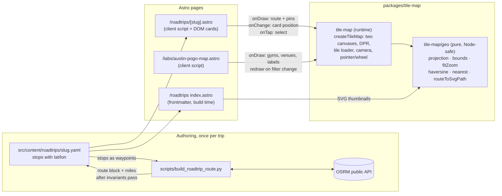

# feat: Road trips as map pages, backed by a shared tile-map package

## Overview

Add a `/roadtrips` section where each trip is a full-page interactive map: CARTO
dark raster tiles, the drive drawn as a real road-following line in the site's
burnt orange, and clickable stop pins that open a floating card with a blurb and
photos. The trip intro is the card open by default, anchored at the start of the
route. The selected stop is reflected in the URL hash so a stop can be linked.
The index at `/roadtrips` lists trips with an inline SVG of each route's shape
as its thumbnail.

The map machinery (Web Mercator projection, tile loader, camera, hit-testing)
moves into a new workspace package, `packages/tile-map`, and the existing Austin
Pokémon GO map is migrated onto it in the same PR so the abstraction has two
consumers from day one. `atxactly.astro` is left alone.

Route geometry is produced once per trip by a stdlib-only Python script that
calls the public OSRM routing API and writes the polyline into the trip YAML.

## Problem Frame

Dr. Fritz wants to document past road trips on the site. The route itself is the
point, not a narrative post, so the natural presentation is the map: the page
_is_ the drive, and the stops along it carry the memories. The site already has
three hand-rolled canvas-over-tiles maps (pogo map, atxactly, the Fredericksburg
hike widget), each with its own copy of the same projection and tile code. A
fourth copy would be the wrong move; this is the moment to extract the shared
core.

No requirements document exists for this work. The framing, behavior, and scope
below were settled in conversation and are recorded here as the source of truth.

## Requirements Trace

- R1. A `roadtrips` content collection: one YAML per trip with `title`,
  `tagline`, `intro` (paragraphs), a `route` polyline of `[lat, lon]` pairs
  following real roads, and `stops`, each with `title`, `lat`, `lon`, `date`,
  `blurb`, and `images` (may be empty; each image has `alt` and an optional
  `caption`). (Units 4, 5)
- R2. `/roadtrips` index: plain list in the style of `/albums`, each row showing
  an inline SVG of the route shape as the thumbnail, computed at build time.
  Linked from the Albums index; the nav stays at six items. (Unit 7)
- R3. `/roadtrips/[slug]`: map-as-page over CARTO dark tiles. Initial view fits
  the route bounds; drag to pan, wheel and buttons to zoom; zoom floor of 4,
  ceiling of 17; the route is a real road-following stroke in burnt orange.
  (Units 2, 6)
- R4. Stop pins are hit-tested by nearest point. Clicking one opens a floating
  card anchored to the pin with title, date, blurb, and photos. Multiple photos
  render as a swipe carousel (the albums pattern) with each photo's caption
  under it. The card flips to the other side of the pin when near an edge and
  docks to the bottom of the map below 640px. (Unit 6)
- R5. The trip intro is a card open by default, anchored to the first route
  coordinate. Clicking the start pin brings it back. On phones the docked intro
  opens collapsed (title, tagline, summary line) and expands on tap. (Unit 6)
- R6. `packages/tile-map`: shared projection, tile loader (retina `@2x`, retry
  then fallback, bounded cache), pan/zoom camera with clamping, and
  nearest-point hit-testing, with unit tests for the pure parts. (Units 1, 2)
- R7. `austin-pogo-map.astro` is migrated onto the package in this PR and
  inherits the tile upgrade. `atxactly.astro` is not touched. (Unit 3)
- R8. A Python OSRM route fetcher in root `scripts/`, stdlib only, run once per
  trip, that writes the road-following polyline into the trip YAML without
  touching any hand-authored line. (Unit 4)
- R9. The PR ships one real trip; Dr. Fritz supplies stop locations and photos
  during implementation. (Unit 5)
- R10. US only. Expressed as the zoom floor, not country bounds; nothing is
  built for international travel.
- R11. The selected stop is reflected in the URL hash (`replaceState`), read on
  load, so a stop can be deep-linked and a reload keeps it open. (Unit 6)
- R12. Every map credits its basemap and routing sources visibly: OpenStreetMap
  and CARTO for tiles, OSRM for the route line, with the Esri credit swapped in
  when the fallback tiles are active. (Units 2, 3, 6)

## Scope Boundaries

- No single national "all trips" map. Each trip is its own page.
- No pinch-to-zoom. Single-finger drag plus zoom buttons cover touch, matching
  the pogo map and atxactly today.
- No `via` waypoints for shaping a route between stops. Stops in YAML order are
  the OSRM waypoints. Revisit if a real trip needs it.
- No browser-history entries per selected stop (`pushState`). Back leaves the
  page. Decided; see Open Questions.
- No swipe-to-dismiss on the docked mobile card. The close button is the
  dismissal for v1.
- No per-trip blog post, OG image generation, or RSS entries.
- No changes to `atxactly.astro`. Observation for later, not in scope: that page
  renders CARTO tiles with no OSM/CARTO attribution in its markup.
- No refactor of the Fredericksburg post's inline hike widget.
- No route editing UI. Routes are authored by running the script.
- No turn-by-turn or live navigation of any kind (CARTO's terms forbid using
  their basemaps for it; a drawn historical route is not that).

## Context & Research

### Relevant Code and Patterns

- Workspace package pattern: `packages/weed-whacker/package.json` (`exports` map
  with a root and a `./leaderboard` subpath, `test`/`typecheck` scripts, vitest
  as the only devDependency, no vitest config file),
  `packages/weed-whacker/tsconfig.json` (strict, `noUncheckedIndexedAccess`,
  `exactOptionalPropertyTypes`, `moduleResolution: bundler`,
  `include: ["src"]`), tests colocated as `src/**/*.test.ts`. Root
  `package.json` lists it as a `file:` dependency and
  `workspaces: ["packages/*"]`; root `tsconfig.json` excludes `packages`. CI
  (`.github/workflows/ci.yml`) runs `npm run typecheck` and `npm test`, both of
  which fan out over workspaces, so a second package is picked up with no CI
  change.
- Mount API pattern: `packages/weed-whacker/src/mount.ts` exports
  `mount(canvas, options)` returning a handle with `destroy()`;
  `src/pages/play.astro` imports from `'weed-whacker'` in its script block.
- Projection and pan/zoom to extract: `src/pages/labs/austin-pogo-map.astro`
  script block (`lonToX`, `latToY`, `xToLon`, `yToLat`, `project`, `unproject`,
  `metersPerPixel`, `metersBetween`, drag handlers, wheel accumulator,
  nearest-gym hover loop with a 14px radius, `canvas.style.cursor` toggling,
  label gate `zoom >= 15`). Pogo has no canvas tap-to-select today; selection is
  driven only by the venue list's locate buttons.
- Tile loader to extract: `src/pages/labs/atxactly.astro` (`getTile` with
  `tileTries`, `TILE_MAX_TRIES`, 600-entry cache trimmed to 300, `@2x` when
  `devicePixelRatio > 1.3`, CARTO `?key=` with Esri/OSM fallback, subdomain
  rotation over `abcd`), DPR-aware `fit()` using `setTransform`, `clampCamera`
  against a lat/lon `BOX`, `zoomBy` that keeps the cursor point fixed, wheel
  step threshold 500 with a 260ms cooldown, `pointercancel` handling,
  `setPointerCapture` on `pointerdown`, `touch-action: none` on the overlay
  canvas, a resize handler ("measured positions go stale on resize"), the
  two-canvas split (`#mt-tiles` under `#mt-over`) with a CSS filter class on the
  tiles canvas to brighten `dark_all`, and `drawTiles` rendering fractional zoom
  by drawing at `round(zoom)` scaled by `2^(zoom - round(zoom))`.
- Modal precedent: atxactly's story card is a `<dialog>` opened with
  `showModal`, which sidesteps DOM-over-canvas pointer conflicts entirely. Its
  `.mt-dialog-photo img` reserves the image box with `aspect-ratio` so text does
  not reflow on load. The roadtrips card deliberately does not use a modal (the
  map must stay interactive), so it is the first element in the repo that is an
  interactive, scrollable DOM node over a pan/zoom canvas.
- CARTO key plumbing: `atxactly.astro` frontmatter reads
  `import.meta.env.PUBLIC_CARTO_API_KEY` and passes it as `data-carto-key`; the
  key lives in gitignored `.env` locally and in the Cloudflare Pages build
  environment for production.
- Route stroke style: `src/content/posts/fredericksburg-trip.md` inline widget
  (`rgba(194,65,12,0.9)`, width 4, round caps and joins).
- Content collection with images: `albums` in `src/content.config.ts`
  (`schema: ({ image }) => ...`, nested `image()` inside an array of objects,
  YAML references `../../assets/albums/...`). Its `link: z.string().url()`
  already emits a Zod 4 deprecation warning under `astro check` (Zod 4 moved
  string formats to top level: `z.url()`).
- Index and detail layout to mirror: `src/pages/albums/index.astro` (row cards,
  `border-border bg-card`, hover `border-primary`) and
  `src/pages/albums/[slug].astro` (back link, title, intro paragraphs with
  `set:html`, `astro:assets` `<Image>` with `widths`/`sizes`).
- Python authoring script conventions: `scripts/build_atxactly_locations.py`
  (`#!/usr/bin/env python3`, module docstring with usage lines, stdlib only,
  `argparse`, `REPO = Path(__file__).resolve().parent.parent`, a `validate()`
  gate before every write, temp file plus rename, runs Prettier on its output so
  the script and CI never fight, never overwrites hand-edited fields).
- Theme tokens: `src/styles/global.css` `:root` (`--primary #c2410c`,
  `--card #131a2e`, `--border #283256`, `--background #0b0f1a`,
  `--foreground #eef2fb`, `--muted-foreground #9aa6c2`).
- Nav: `src/layouts/Base.astro` `nav` array, six items.
- Lint surface: Prettier formats `.yaml` and `.astro` (`proseWrap: always`);
  Vale runs on `*.md` only; codespell in CI runs on `src/content`, which will
  include trip YAML.

### Institutional Learnings

`docs/solutions/` does not exist. From
`docs/handoff/2026-08-30-001-atxactly-gameplay-polish.md`,
`docs/reviews/2026-08-31-001-feat-22-austin-maptapp-location-pipeline-review.md`,
and `docs/plans/2026-07-03-001-feat-weed-whacker-web-v1-plan.md`:

- Keyless CARTO returns a watermarked "API KEY REQUIRED" tile with HTTP 200. The
  wrong parameter name (`api_key` instead of `key`) does the same. Neither is
  detectable from `onload`/`onerror`; only a human looking at the map can catch
  it. Verification of tile correctness is visual.
- Esri Canvas Dark Gray Base prints labels from about z15 and is acceptable only
  as a fallback. Esri Terrain and wmflabs no-labels were ruled out; do not
  re-search.
- `@2x` tiles plus integer zoom stepping fixed most retina blur in atxactly.
- A trackpad flick delivers thousands of wheel delta in a few hundred ms; the
  pogo map's 120-delta threshold with no cooldown lets one flick run the whole
  zoom range. atxactly's 500 threshold plus 260ms cooldown is the fix.
- The pogo map has no `pointercancel` handler (an interrupted gesture leaves
  drag state stuck), no DPR handling (fixed 1000x660 buffer scaled by CSS), no
  resize handling, an unbounded tile cache, and no pan clamp. All of these are
  addressed by the migration in Unit 3.
- Nothing in atxactly was tested on a touchscreen. Treat touch as unverified
  until checked on a phone.
- The atxactly location pipeline had one silent geometry corruption (a polygon
  shrank from 404 to 68 acres) caught only in review. Geometry helpers in
  authoring scripts need tests and a validation gate, not trust.
- Workspace packages: root tsconfig must exclude `packages/` or `astro check`
  sweeps it; Vite transforms linked workspace deps from source so `exports`
  pointing at `./src/*.ts` works.

### External References

Verified during deepening, in this repo, with the installed toolchain (astro
6.4.8, vite 7.3.5, typescript 6.0.3, @astrojs/check 0.9.9, Node 22):

- **Frontmatter import of a workspace package works today with no config.** A
  probe page whose frontmatter imported `weed-whacker/leaderboard` built and
  rendered the runtime value; a deliberate type error in that frontmatter was
  caught by `astro check` through the `exports` map. Basis: Vite's SSR rule "all
  dependencies are externalized except for linked dependencies" (a `file:`
  workspace install is a symlink, so it is linked and gets transformed)
  (https://vite.dev/config/ssr-options.html, https://vite.dev/guide/ssr.html).
  Escape hatch if a non-symlinked install ever appears: `vite.ssr.noExternal` in
  `astro.config.mjs`
  (https://docs.astro.build/en/reference/configuration-reference/).
- `astro check` resolves types for excluded-but-imported packages because
  `exclude` controls root files, not dependency resolution, and Astro's base
  tsconfig uses `moduleResolution: Bundler`, which reads `exports` and accepts
  `.ts` targets. No `paths` or `types` conditions needed.
- Astro 6 content collections: `glob` loader for YAML, function-form
  `schema: ({ image }) => ...`, and `image()` nested in arrays are all current
  (and already proven by `albums`). `z.array(z.tuple([z.number(), z.number()]))`
  validates and rejects short tuples under the installed Zod 4
  (https://docs.astro.build/en/guides/content-collections/,
  https://zod.dev/v4/changelog). Known cosmetic issue: function-form schemas can
  show `data: unknown` in the IDE while `astro check` passes
  (withastro/astro#16001, closed not planned). Do not drop the function form
  over it.
- Astro 6 image service: crops by default when both `width` and `height` are
  set; never upscales, so `widths` above the source width silently produce fewer
  srcset candidates. `<Image>` `widths`/`sizes` props are unchanged
  (https://docs.astro.build/en/guides/upgrade-to/v6/,
  https://docs.astro.build/en/reference/modules/astro-assets/).
- Astro 6: `import.meta.env` values are inlined with no coercion, so an unset
  `PUBLIC_CARTO_API_KEY` reads as `""`, not `undefined`; `Astro.site` is
  deprecated inside `getStaticPaths` (use `import.meta.env.SITE`); scripts and
  styles render in source order.
- **OSRM demo server**
  (https://github.com/Project-OSRM/osrm-backend/wiki/Demo-server,
  https://github.com/Project-OSRM/osrm-backend/wiki/Api-usage-policy):
  reasonable non-commercial use only, best effort, may be withdrawn without
  notice, **do not exceed 1 request per second**, must send a valid identifying
  `User-Agent` and a `Referer` when possible, must attribute OSRM as the routing
  engine and OSM data under ODbL. The demo's configured waypoint cap is not
  published (upstream default is 500 for route; unconfirmed for the demo). Route
  API (https://project-osrm.org/docs/v5.24.0/api/): `code` values `Ok`,
  `NoRoute`, `InvalidQuery`, `TooBig`, and others with an optional `message`;
  `routes[0].geometry.coordinates` as `[lon, lat]` when `geometries=geojson`;
  `distance` meters; `duration` seconds; `overview=simplified` is the default
  and `full` returns full detail.
- Fallback routers if the demo is down: OpenRouteService free plan caps at 50
  waypoints and 6,000 km (https://openrouteservice.org/restrictions/). Not
  planned; noted for `--base-url`.
- **Douglas-Peucker tolerance**: 0.001° is about 100 m (Turf's default,
  described as "a city block"); half-pixel ground resolution at z10 is about 76
  m (0.0007°). Longitude degrees are about 15% shorter than latitude degrees in
  Texas, so a degree tolerance is slightly anisotropic. Always simplify from the
  original geometry, never from an already simplified block. No citable
  point-count figure exists; measure it on the first trip
  (https://turfjs.org/docs/api/simplify,
  https://tschaub.net/blog/2014/03/04/topology-preserving-simplification.html).
- **CARTO basemaps** (https://carto.com/legal/basemap-terms/,
  https://carto.com/basemaps/apikey/,
  https://github.com/CartoDB/basemap-styles): 5M tile requests per calendar
  month across all of a customer's keys; `?key=` is the parameter; keyless
  requests are watermarked; client-side keys are the expected usage but there is
  no referrer restriction, so the key is copyable; attribution must be
  "prominent and conspicuous" and CARTO's own string is
  `© OpenStreetMap, © CARTO` with links to openstreetmap.org/copyright and
  carto.com/attributions; raster basemaps are on a soft deprecation path in
  favor of vector styles (`dark_all` maps to `dark-matter-gl-style`).
- **Esri World Dark Gray Base**: service `copyrightText` is "Esri, HERE, Garmin,
  © OpenStreetMap contributors, and the GIS user community"; global coverage
  through z10, regional (including North America) to z16; in mature support
  since 2021 with a legacy-basemap sunset in 2028-2029. Keyless third-party use
  is customary (Leaflet-providers ships it) but no explicit Esri grant was
  found; it is a fallback by convention
  (https://services.arcgisonline.com/ArcGIS/rest/services/Canvas/World_Dark_Gray_Base/MapServer,
  https://www.esri.com/arcgis-blog/products/arcgis-living-atlas/announcements/sunsetting-legacy-basemaps).
- **ODbL attribution for the route line**: the route is a Produced Work from OSM
  data; credit to OpenStreetMap linking to the copyright page must be visible to
  anyone viewing the map, and OSRM's policy adds a routing credit
  (https://osmfoundation.org/wiki/Licence/Attribution_Guidelines).

## Key Technical Decisions

### Package and contract

- **Package, not `src/lib`**: `packages/tile-map` mirrors weed-whacker. The
  projection, fit, camera, and hit-test math are pure and deserve tests; the
  strict per-package tsconfig is already the established way to get them.
- **Two entry points**: `tile-map` (runtime: DOM, canvases, tiles) and
  `tile-map/geo` (pure: projection, bounds, fit zoom, haversine, nearest, SVG
  path). `index.astro` imports `tile-map/geo` in frontmatter at build time to
  draw thumbnails. Verified to work with no `vite.ssr` config (see External
  References). Enforcement is structural, not by convention: files under
  `src/geo/` may import only from `src/geo/`, and a test that imports
  `tile-map/geo` under vitest's default Node environment (no DOM shim) runs in
  CI, so a stray `window`/`Image` reference fails at test time rather than in
  `astro build`.
- **Two stacked canvases owned by the package**:
  `createTileMap(container, options)` inserts a tiles canvas and an overlay
  canvas as children of the container, sizes both DPR-aware via
  `ResizeObserver`, draws tiles itself, and calls the consumer's
  `onDraw(ctx, view)` for the overlay. The package never touches, reorders, or
  clears the container's other children, so pages keep adding zoom buttons,
  attribution, and DOM cards as absolutely positioned siblings, which is how
  both current consumers are already laid out. Rejected alternative: a
  consumer-provided canvas. It would leave every consumer writing the DPR sizing
  and two-canvas split themselves, which is the code this package exists to
  remove.
- **Contract surface, beyond callbacks**: the handle exposes `setCursor(css)`
  (pogo toggles `pointer`/`grab` on hover today and has no canvas reference
  after migration), `redraw()` defined as "re-invoke `onDraw` against the cached
  view; no tile fetch, no camera recompute" (this is pogo's hot path for filter
  and radius changes, and it is distinct from `onChange`, which fires only for
  view changes), and a documented class name on the tiles canvas so a page can
  apply a CSS `filter` to tiles only (atxactly needed a brightness lift on
  `dark_all`). `onChange(view)` fires after any camera change **and** after a
  resize or DPR change, because measured DOM positions (the card) go stale on
  both.
- **Module split**: `tiles/source.ts` (pure URL builder), `tiles/loader.ts`
  (cache and retries; depends only on tile coordinates and a redraw callback,
  never on the camera, so it stays independently importable), `camera.ts` (pure
  state and math), `map.ts` (DOM lifecycle and orchestration). Nothing moves for
  atxactly; if it ever adopts the loader alone, the loader's camera-independence
  is what makes that possible without promising the work.
- **Tile source preset**: `cartoDark(key)` returns CARTO `dark_all` with retina
  `@2x` when a key is present and Esri Canvas Dark Gray Base when it is empty,
  with the same retry-then-fallback behavior as atxactly. Both new consumers
  want labels (town names on a drive, street names for gyms), so `dark_nolabels`
  is not needed and atxactly keeps its own dual-layer setup. The key check is a
  truthiness check (`""` when unset under Astro 6, never `undefined`). The
  handle reports which source is active so the page can render the matching
  attribution.
- **Camera**: initial zoom is the fractional value that fits the content bounds
  with padding (atxactly's `minZoom` search, generalized); wheel and buttons
  step to whole levels from there. Consequence, accepted and stated: the first
  paint renders tiles at a scaled, not 1:1, resolution (drawn at `round(zoom)`
  and scaled by `2^(zoom - round(zoom))`, as atxactly does); it becomes sharp
  after the first zoom step. Zoom-gated behavior in consumers (pogo's label
  threshold) compares against the fractional `view.zoom`, so a fit of 14.7 hides
  labels that appear at 15. Zoom clamps to a per-consumer `[min, max]`
  (`[4, 17]` for trips, `[11, 18]` for pogo). Center clamps to the content
  bounds, exactly atxactly's `clampCamera` with the bounds computed from data.
  Padding is per-side, not uniform, so the mobile dock can reserve the bottom
  band (see below). Hit radius is zoom-independent by construction (screen
  pixels) and is 14px for fine pointers and about 22px under
  `(pointer: coarse)`.

### Data and authoring

- **Route in the YAML, written textually**: the script locates the top-level
  `route:` key and replaces the span from that line up to the next line matching
  `^\S` or end of file with a block-style list, one `- [lat, lon]` per line,
  formatted with a fixed-width `%.5f` (never bare `round()`, so `30.1` always
  writes as `30.10000`). Stdlib only, no PyYAML. Invariants asserted before
  writing: exactly one top-level `route:` and at most one top-level `miles:` in
  the constructed text; the file's line-ending style and trailing-newline state
  are detected and preserved; `head + block + tail` line count equals the
  original minus the replaced span; a re-scan of the constructed text yields the
  identical stop coordinates that were read. Any failed invariant exits non-zero
  with no write. After the rename the script runs Prettier on the file, as
  `build_atxactly_locations.py` does, so its output and CI's format check never
  disagree. Rejected alternative: a sibling JSON under `src/data/` (splits one
  trip across two directories) or a custom Astro loader (overkill for one
  field).
- **Stops scan is bounded and refuses ambiguity**: `lat:`/`lon:` are matched
  only inside the byte range from the top-level `stops:` line to the next
  top-level key, so a coordinate mentioned in an `intro` block scalar cannot
  leak in. The script refuses when the counts of `lat:`, `lon:`, and `- title:`
  under `stops:` differ, when fewer than two stops exist, or when more than one
  top-level `stops:` exists. Not supported, stated in the docstring: flow-style
  stops (`{lat: .., lon: ..}`), inline comments after coordinate values, and
  commented-out stops that still contain `lat:`. The script warns (non-fatal,
  since real trips can backtrack) when stop dates are not non-decreasing in YAML
  order, because YAML order is the OSRM waypoint order and an out-of-order stop
  produces a zigzag route that OSRM will happily return.
- **`[lat, lon]` order in YAML**: matches `pogo-gyms.json`, the Fredericksburg
  widget, and the stop fields. The script flips OSRM's `lon,lat` on both the
  request and the response. A lat/lon swap on the request presents as OSRM
  `InvalidQuery` or a route through the Indian Ocean; the script sanity-checks
  that the returned geometry lies within the bounding box of the stops padded by
  a few degrees.
- **Simplification in the script**: request `overview=full` (the script owns
  simplification so re-tuning is deterministic), then Douglas-Peucker with a
  `--tolerance` flag defaulting to 0.001° (about 100 m, half a pixel at z10).
  Each run re-fetches from OSRM, so simplification always starts from original
  geometry. The script prints raw and simplified point counts; the measured
  numbers for the first trip get recorded in this plan's Deferred section when
  known. It also writes `miles` from `distance / 1609.344`, rounded to an
  integer, using one documented formula.
- **OSRM etiquette**: a single request per run (well under 1 req/s), a
  descriptive `User-Agent` naming the site and script, a `Referer` of the site
  URL, two retries with backoff on 429/5xx, a `--base-url` override for a
  self-hosted or alternative OSRM instance, and per-code handling: `NoRoute`
  names the likely unsnappable stop, `InvalidQuery` suggests the lat/lon swap,
  `TooBig` suggests fewer waypoints.
- **Dates derive from stops**: no `start`/`end` on the trip. The index shows a
  range from the earliest to latest stop date.

### Page behavior

- **Stop cards are server-rendered**: every stop card, and the intro card, is
  emitted as hidden markup by `[slug].astro` with `astro:assets` `<Image>` so
  photos go through the normal optimization pipeline. The client script only
  toggles which card is visible and positions it. Pins and the route are
  canvas-drawn on the overlay; cards are DOM. Rejected alternative: atxactly's
  modal `<dialog>`, which would make the map non-interactive while a card is
  open. It remains the named escape hatch if the DOM-over-canvas approach proves
  unworkable during Unit 6.
- **Photo carousel and one stop per place**: a stop's images render in the
  snap-scroll carousel already built for `albums/[slug].astro` (dots,
  click-to-advance), with an optional per-image `caption` under the slide.
  Photos taken within a few meters of each other (a gas station and the hotel
  across from it) belong to one stop, because two pins 7 m apart cannot be told
  apart at any zoom the page allows; the captions carry the per-photo story.
  Decided during Unit 5 when the first trip's photos arrived.
- **Event ownership between card and canvas** (new territory in this repo): the
  card is a DOM sibling above the overlay canvas. The card sets
  `touch-action: pan-y` so vertical swipes scroll its content; it stops `wheel`
  propagation so the page neither scrolls nor zooms the map under the cursor;
  the package sets pointer capture on `pointerdown` so a pan begun on the canvas
  continues when the pointer crosses the card; the card has no dead zone (the
  close button's hit area reaches the card edge) so no tap aimed at the card
  falls through to the deselect path.
- **Stable card size**: card images reserve their box with a fixed
  `aspect-ratio` and `object-fit: cover` (atxactly's `.mt-dialog-photo img`
  pattern) and load eagerly (they are behind a tap, not below the fold), so the
  card's height is final the moment it is unhidden and positioning is computed
  once. `widths` are capped at the smallest expected source width because Astro
  6 never upscales.
- **Card anchoring**: absolutely positioned inside the map container, left edge
  14px right of the projected pin, vertically centered on it, clamped to the
  container; flips to 14px left of the pin when the right edge would overflow.
  Repositioned on every `onChange` (camera, resize, DPR). Below 640px (Tailwind
  `sm`) CSS docks the card across the container bottom and the script skips
  positioning; the docked/anchored mode is re-evaluated on `matchMedia`
  `change`, not only at startup, so rotating a phone across the breakpoint
  switches modes.
- **Mobile dock compensation**: below 640px the fit padding is asymmetric
  (bottom padding equals the docked card's height) so the route fits in the
  visible band, and the camera's center clamp is relaxed at the bottom by the
  same amount so a pin under the dock can be panned clear of it. Without this,
  the southernmost stop of a north-south route is untappable on a phone.
- **Intro is trip-level data**: `intro` stays a trip field, not a stop. It is
  rendered as the default-open card anchored to `route[0]`, and the start pin
  reopens it. On phones the docked intro opens **collapsed**: title, tagline,
  and one summary line (stop count, miles, date range), tap to expand. Stop
  cards dock fully expanded. Desktop is unchanged.
- **Selection and camera transitions** (one rule for both entry points: pan,
  never zoom):

  | Event                               | Selection     | Camera                                             |
  | ----------------------------------- | ------------- | -------------------------------------------------- |
  | Load, no hash                       | `intro`       | fit route (padded for dock on mobile)              |
  | Load, `#stop-N`                     | stop N        | fit route, then pan so pin and card fit            |
  | Tap pin                             | that stop     | pan only if the card would be clipped              |
  | Tap start pin (nearest `route[0]`)  | `intro`       | as above                                           |
  | Stop-list button                    | that stop     | pan so pin and card fit; zoom unchanged            |
  | Tap empty map, Escape, close button | `null`        | unchanged                                          |
  | Select while another card is open   | swap directly | as for the new selection                           |
  | Pan/zoom while selected             | unchanged     | card follows; if the pin leaves the view, the card |
  |                                     |               | clamps to the container edge and stays open        |

- **URL hash**: selection writes `#stop-N` (intro is the bare URL) with
  `history.replaceState`; the script reads the hash on load and listens for
  `hashchange`. `pushState` was rejected: back should leave the page, not unwind
  card history.
- **Hover**: hover styling and cursor changes apply only when `(hover: hover)`
  matches, so a touch tap never leaves a stuck "hovered" pin (touch fires
  `pointermove` before `pointerup` and does not reliably fire `pointerleave`).
- **Keyboard and focus**: opening a card moves focus into it (`tabindex="-1"` on
  the article) so the next Tab reaches its close button; closing returns focus
  to the control that opened it (stop-list button, or the map container for a
  pin tap); stop-list buttons carry `aria-expanded`; Escape is handled at the
  card before anything map-level. Pins are not individually focusable; the stop
  list is the accessible equivalent, and the map container carries a short
  `aria-label`. No live region.
- **Attribution**: the map corner renders
  `© OpenStreetMap, © CARTO · Routing by OSRM`, with OpenStreetMap linking to
  its copyright page and CARTO to its attributions page. When the handle reports
  the Esri fallback is active, the tile credit swaps to Esri's `copyrightText`.
  Pogo renders the same tile credit without the routing clause. This is a
  license obligation for CARTO, ODbL, and OSRM, not a nicety.
- **Discovery**: a callout row on `/albums/index.astro` links to `/roadtrips`.
  The nav is unchanged.

## Open Questions

### Resolved During Planning

- Albums vs. its own section: own section. Albums entries are terminal photo
  grids; trips are maps with a route. Forcing them into the albums schema would
  change the renderer for every album.
- One national map vs. per-trip: per-trip. At continental zoom, pins collide and
  routes read as squiggles.
- Where the shared code lives: workspace package (see Key Technical Decisions).
- Route source format: real roads via OSRM, stored in the trip YAML.
- Nav placement: link from Albums, nav stays at six.
- Seed content: one real trip, stops and photos from Dr. Fritz during Unit 5.
- Frontmatter import of `tile-map/geo`: needs no Vite config; verified by
  building a probe page against `weed-whacker/leaderboard` in this repo.
- Does the stop list change zoom: no. Both selection paths pan only. Jumping
  from a fitted 1,000-mile route to z16 loses the route.
- Does a selected pin panned off-screen deselect: no. The card clamps to the
  container edge and stays open until the user closes it.
- Hash state: `replaceState`, not `pushState`. Dr. Fritz's call.
- Mobile intro at load: collapsed dock, tap to expand. Dr. Fritz's call.
- Swipe-to-dismiss the dock: not in v1; the close button suffices.
- Camera-padding shape: per-side, because the mobile dock needs a bottom
  reservation. Uniform padding was the original sketch.

### Deferred to Implementation

- Exact map height on `[slug]`: settled at `calc(100dvh - 20rem)` with
  `min-height: 420px`. 20rem is the measured header, back link, title, and
  tagline stack; at 1280x900 it yields a 578px map and at 390x844 a 524px map
  with the stop list just below the fold.
- Whether `dark_all` needs a brightness filter at trip zoom levels the way
  atxactly's results map did at z11. Not needed: at the fitted zoom (z7 to z8)
  and through z17, `dark_all` reads fine under the burnt-orange route with no
  filter. The tiles-canvas class hook is unused on this page.
- Measured Douglas-Peucker results, recorded from the first trip (Austin to
  Cinnamon Shore, 229 miles): 3,578 raw points simplified to 129 at 0.001°, a
  129-line `route:` block. The default tolerance stands. (First run, before the
  JFK Causeway stop was nudged off the wrong carriageway: 3,684 raw, 133
  simplified, 235 miles, with a visible U-turn loop at the causeway.)
- The OSRM demo server accepted 8 waypoints and reported 8 snapped; the cap
  remains unpublished and untested above that.
- Card geometry, set against the real trip: 320px wide, offset 14px from the
  pin, 8px clamp inset, flip when the right edge would pass
  `containerWidth - 8`. The card does need `max-height` with internal scroll:
  `70%` of the container anchored, `60%` docked. Photos are additionally capped
  at `max-height: 12rem` inside their 3:4 aspect box, and every slide in a stop
  reserves the same caption band so advancing the carousel never resizes the
  card. The anchored card also stops `20px` short of the bottom so the
  attribution strip stays legible.
- Docked card height used for the asymmetric fit padding: measured at mount by
  unhiding the collapsed intro card and reading its rendered height, then
  re-measured on the `matchMedia` change. At 390px the collapsed dock measures
  123px, so the bottom fit padding is 131px.
- Whether pogo's labels and scale bar need size adjustments after moving from
  the 1000px internal buffer to CSS-pixel drawing (they will render at their
  nominal size for the first time; likely fine).
- Codespell false positives on place names in trip YAML; add an ignore list to
  the CI step only if it actually fails.

## High-Level Technical Design

> _This illustrates the intended approach and is directional guidance for
> review, not implementation specification. The implementing agent should treat
> it as context, not code to reproduce._



Runtime contract, directionally:

```
createTileMap(container, {
  source: cartoDark(key),          // url(z,x,y,retina,attempt); reports active source
  bounds,                          // content lat/lon box; center clamps to it
  zoom: { min, max },              // whole-level range after the initial fit
  padding: { top, right, bottom, left },   // per-side, for the mobile dock
  onDraw(ctx, view),               // overlay pass; view: project/unproject/zoom/mpp/w/h
  onChange(view),                  // after camera change, resize, or DPR change
  onTap(px, py, view),             // pointerup without drag; consumer hit-tests
  onHover(px, py, view),           // pointermove without drag (fine pointers)
}) -> {
  fitBounds(), setView(center, zoom), panTo(center), zoomBy(steps, px?, py?),
  redraw(),                        // onDraw only; no tiles, no camera
  setCursor(css), activeSource(), destroy()
}
// tiles canvas carries a documented class for an optional CSS filter
```

Card and canvas event ownership on `[slug]`, directionally:

```
container (relative)
  ├─ tiles canvas          (package; pointer-events: none)
  ├─ overlay canvas        (package; touch-action: none; pointer capture on down)
  ├─ zoom buttons, attribution   (page; absolute)
  └─ card <article>        (page; absolute or docked; touch-action: pan-y;
                            stops wheel; no dead zone at edges)
```

## Implementation Units

### Phase A: shared package

- [x] **Unit 1: Scaffold `packages/tile-map` with the pure `geo` module**

**Goal:** A second workspace package exists, is wired into root tooling, and
exports tested pure geometry: Mercator projection, bounds, fit zoom, haversine,
nearest-point, and route-to-SVG-path, importable from Astro frontmatter.

**Requirements:** R6, R2 (thumbnail math)

**Dependencies:** None

**Files:**

- Create: `packages/tile-map/package.json`
- Create: `packages/tile-map/tsconfig.json`
- Create: `packages/tile-map/src/geo/projection.ts`
- Create: `packages/tile-map/src/geo/bounds.ts`
- Create: `packages/tile-map/src/geo/svg.ts`
- Create: `packages/tile-map/src/geo/index.ts`
- Create: `packages/tile-map/src/index.ts` (re-exports geo for now; runtime
  lands in Unit 2)
- Test: `packages/tile-map/src/geo/projection.test.ts`
- Test: `packages/tile-map/src/geo/bounds.test.ts`
- Test: `packages/tile-map/src/geo/svg.test.ts`
- Test: `packages/tile-map/src/geo/node-import.test.ts`
- Modify: `package.json` (add `"tile-map": "file:packages/tile-map"`)

**Approach:**

- Copy weed-whacker's `package.json` shape: `exports` with `"."` and `"./geo"`,
  `test`/`typecheck` scripts, vitest devDependency, no config file. Copy its
  tsconfig verbatim (it already has `moduleResolution: bundler`).
- `projection.ts`: world-pixel functions parameterized by zoom (`lonToX`,
  `latToY`, `xToLon`, `yToLat`, tile size constant, meters per pixel at a
  latitude and zoom). Fractional zoom is supported throughout.
- `bounds.ts`: `boundsOf(points)`,
  `fitZoom(bounds, viewW, viewH, padding, minZoom, maxZoom)` with per-side
  padding, returning the fractional zoom at which the bounds fit;
  `haversineMeters(a, b)`; `nearest(points, px, py, project, radiusPx)`.
- `svg.ts`: `routeToSvgPath(route, width, height, padding)` projects at a fixed
  reference zoom, scales and centers to the box preserving aspect, and returns
  the path `d` and `viewBox` strings. It does not share an aspect-fit primitive
  with `fitZoom`; the two serve different domains (tile zoom levels vs an
  arbitrary box) and the duplication is intentional. Say so in a one-line
  comment only if a reader would otherwise reach for a shared helper.
- Structural rule: files under `src/geo/` import only from `src/geo/`. No DOM
  globals anywhere in the directory, at module scope or call time.

**Patterns to follow:**

- `packages/weed-whacker/package.json`, `tsconfig.json`, and
  `src/leaderboard/index.ts` as the subpath-export precedent.
- Formulas from `austin-pogo-map.astro` (`lonToX`, `latToY`, `xToLon`, `yToLat`,
  `metersBetween`).

**Test scenarios:**

- Projection round-trips: `xToLon(lonToX(lon, z), z)` and the lat equivalent
  return the input within 1e-9 for a spread of Austin, Marfa, and equator
  coordinates at zooms 4, 11, and 17.
- Known anchors: lon 0 maps to half the world width; lat 0 maps to half the
  world height; lat 85.05 maps to near 0.
- `fitZoom` result places both bounds corners inside the padded view, and one
  level higher does not; asymmetric padding (large bottom) shifts the fit so the
  bounds sit in the upper band.
- `fitZoom` is clamped to `[minZoom, maxZoom]` when the bounds are tiny or
  enormous.
- `haversineMeters` for Austin to Marfa is about 640 km, within 1%.
- `nearest` returns the closest point within the radius, `null` when none is
  within it, and prefers the closer of two candidates.
- `routeToSvgPath` for a two-point diagonal produces `M` then `L` with
  coordinates inside `[padding, size - padding]`; a horizontal-only route is
  vertically centered; output has no `NaN`.
- Node import: importing `./index` under vitest's default Node environment
  succeeds and a handful of exports are functions. This is the guard for
  frontmatter safety.

**Verification:**

- `npm run typecheck` and `npm test` from the root pick up the new package
  without any script changes.
- `package-lock.json` gains the workspace link; `node_modules/tile-map` resolves
  as a symlink.
- An `astro build` (not only `astro dev`) succeeds with a page whose frontmatter
  imports `tile-map/geo`; Unit 7's index is the permanent consumer, but confirm
  it here with a throwaway page that is deleted before the unit closes. If
  `ERR_UNKNOWN_FILE_EXTENSION ".ts"` ever appears, the fix is
  `vite.ssr.noExternal: ['tile-map']` in `astro.config.mjs`.

- [x] **Unit 2: Runtime: tile loader, camera, pointer handling,
      `createTileMap`**

**Goal:** A DOM-backed map factory that owns two DPR-aware canvases, loads CARTO
dark tiles with retina, retry, fallback, and a bounded cache, drives a clamped
pan/zoom camera from pointer and wheel input, and exposes the contract both
consumers need (`redraw`, `setCursor`, `activeSource`, `onChange` on resize).

**Requirements:** R3, R6, R7, R12

**Dependencies:** Unit 1

**Files:**

- Create: `packages/tile-map/src/tiles/source.ts` (URL builders, `cartoDark`
  preset, fallback selection by try count, Esri credit string)
- Create: `packages/tile-map/src/tiles/loader.ts` (cache, retries, load
  callback; no camera dependency)
- Create: `packages/tile-map/src/camera.ts` (center/zoom state, clamp with
  per-side padding, project and unproject for a view size, `panBy`, `zoomAt`)
- Create: `packages/tile-map/src/map.ts` (`createTileMap`)
- Modify: `packages/tile-map/src/index.ts` (export runtime and types)
- Test: `packages/tile-map/src/tiles/source.test.ts`
- Test: `packages/tile-map/src/camera.test.ts`

**Approach:**

- `source.ts` is pure: given `{z, x, y, retina, attempt}` return the URL. CARTO
  `dark_all` with `?key=` and `@2x` when retina, subdomain from
  `'abcd'[(x + y) % 4]`; after two failed attempts with a key, or immediately
  without one, Esri Canvas Dark Gray Base (note Esri's `{z}/{y}/{x}` order).
  Also exposes the attribution HTML for each source so pages never hard-code it
  twice.
- `loader.ts` ports atxactly's `getTile`: `Map` cache trimmed from 600 to 300
  oldest entries, per-key try counter capped at 3 with key and 2 without,
  exponential-ish retry delay, `data-failed` marker after the last try, and an
  `onLoad` callback the map uses to redraw tiles. Its inputs are tile
  coordinates and that callback only; it must not import `camera.ts`.
- `camera.ts` is pure state plus math: `clamp()` restricts zoom to the range and
  center to bounds (bottom clamp relaxed by the bottom padding);
  `zoomAt(steps, px, py, view)` rounds to a whole level and shifts center so the
  point under the cursor stays fixed (atxactly's `zoomBy`); `panBy(dx, dy)` in
  CSS pixels; `panTo(center)`.
- `map.ts` inserts the two canvases as children of the container without
  touching other children, sets `pointer-events: none` on the tiles canvas and
  `touch-action: none` on the overlay, observes resize and sizes buffers by
  `min(devicePixelRatio, 2)` with `setTransform`, draws tiles (fractional zoom
  drawn at `round(zoom)` and scaled; looping x across the antimeridian; skipping
  y out of range), then calls `onDraw`. Pointer: `pointerdown` captures the
  pointer, `pointermove` pans when dragging and reports hover otherwise,
  `pointerup` without movement over 4px reports a tap, `pointercancel` resets
  drag. Wheel: accumulate delta, step one level when past 500, 260ms cooldown,
  `passive: false`. `onChange` fires after camera changes and after the resize
  observer runs. `redraw()` re-invokes `onDraw` against the cached view and
  nothing else. `setCursor` writes the overlay canvas cursor. `activeSource()`
  reports `carto` or `esri`. `destroy()` removes listeners, the observer, and
  the two canvases.

**Technical design:** _(directional)_ the consumer never sees tile code; it
receives a `view` object with `project`, `unproject`, `zoom` (fractional),
`metersPerPixel`, `width`, `height` in every callback.

**Patterns to follow:**

- `atxactly.astro`: `getTile`, `fit`, `clampCamera`, `zoomBy`, wheel handling,
  `pointercancel`, pointer capture, two-canvas layering, fractional tile draw.
- `weed-whacker/src/mount.ts`: factory returning a handle with `destroy()` that
  removes listeners and observers.

**Test scenarios:**

- `source`: with a key, attempt 0 and 1 produce CARTO URLs (retina suffix
  present only when `retina` is true), attempt 2 produces the Esri URL; with no
  key every attempt produces Esri; subdomain rotates with `x + y`; attribution
  strings for both sources contain the OpenStreetMap copyright link.
- `camera`: clamping keeps zoom within range and center within bounds, and
  relaxes the bottom bound by the bottom padding; `zoomAt` at the view center
  leaves the center unchanged; `zoomAt` at an off-center point leaves that
  point's lat/lon unchanged (project it before and after); `panBy` by the width
  of one tile at zoom z shifts center by 360 / 2^z degrees of longitude.
- Cache trimming: after inserting 601 keys the size drops to about 300 and the
  newest keys survive (isolate the trim function; no DOM needed).

**Verification:**

- A throwaway page or the Unit 3 pogo migration shows tiles at 2x sharpness on a
  retina display after one zoom step, no blank squares after a simulated tile
  failure, and a trackpad flick changes zoom by one or two levels, not the whole
  range.
- Before Unit 3 is considered done, `onTap` and `onChange` are exercised by hand
  (a console-logging callback is enough): a tap reports CSS-pixel coordinates, a
  drag does not, and `onChange` fires on drag, zoom, `setView`, `fitBounds`, and
  a window resize. Unit 6 is the first real consumer of both, three units later;
  this check keeps a contract gap from surfacing there.
- `destroy()` leaves no listeners (a second mount in the same container does not
  double-handle pointer events).

### Phase B: migrate the existing consumer

- [x] **Unit 3: Migrate `austin-pogo-map.astro` onto `tile-map`**

**Goal:** The pogo map renders through the package with no loss of behavior
(radius scoring, filters, hover labels, venue list, locate buttons, reset, scale
bar) and gains CARTO dark tiles, retina sharpness, resize handling, a pan clamp,
`pointercancel`, rate-limited wheel zoom, and correct attribution.

**Requirements:** R7, R12

**Dependencies:** Unit 2

**Files:**

- Modify: `src/pages/labs/austin-pogo-map.astro`
- `src/pages/labs/atxactly.astro` is **not** modified; listed to make the
  boundary explicit.

**Approach:**

- Frontmatter reads `PUBLIC_CARTO_API_KEY` (truthiness, not `undefined` check)
  and passes it via a data attribute, as atxactly does.
- Replace the fixed `<canvas width=1000 height=660>` with a container `div` of
  explicit height (keep the current aspect around 3:2 via an aspect-ratio class)
  that the package fills with its two canvases. Remove the
  `canvas.width / r.width` scaling everywhere; pointer coordinates from the
  package are already CSS pixels.
- Delete the inline projection, tile cache, drag, wheel, and hover-search code.
  Keep and adapt: `visibleVenues`, `metersBetween` (import haversine from
  `tile-map/geo`), the drawing functions (`circle`, `square`, `label`,
  `drawScale`) which now take the `view` from `onDraw`, `renderList`, filter
  menus, radius slider, locate buttons (`setView(center, 16)`), reset
  (`fitBounds()`), and zoom buttons (`zoomBy(±1)`). Filter and radius changes
  call `redraw()`, not a camera method.
- Hover uses `nearest` from `geo` against gyms with a 14px radius inside the
  `onHover` callback and `setCursor` for the pointer/grab toggle.
- The label gate compares against the fractional `view.zoom` (initial fit may be
  14.x, so labels appear after the first zoom-in step, which matches today's
  behavior at whole levels).
- Bounds for the camera clamp: `boundsOf([...gyms, ...venues])` padded so a user
  at zoom 18 can still center on an edge gym. Zoom range `[11, 18]` unchanged.
- Basemap changes from OSM plus a heavy multiply overlay to CARTO `dark_all`;
  drop or greatly reduce the multiply pass (decide visually; the tiles-canvas
  filter class is the alternative). Attribution becomes the package's tile
  credit for the active source (`© OpenStreetMap, © CARTO`, or Esri's string
  when the fallback is active), replacing the current OSM-only line.
- Update the legend hint if wording no longer matches.

**Patterns to follow:**

- `play.astro` for importing a workspace package in a script block and passing a
  data attribute from frontmatter.

**Test scenarios:** (manual, this is a page)

- Initial load frames all gyms and venues; tiles are CARTO dark and not
  watermarked; reset view returns to that frame.
- Dragging pans; releasing mid-drag via a browser gesture does not leave the map
  stuck panning.
- Hovering a gym shows its label and pointer cursor; leaving clears it.
- Radius slider recolors venues and updates the list; each filter menu still
  narrows the set; Clear all restores it; none of these refetch tiles (network
  tab quiet).
- Locate button centers on the venue at zoom 16 and highlights its card.
- Wheel zoom steps whole levels and keeps the point under the cursor fixed.
- Resizing the window redraws at the new size with no blur on retina after a
  zoom step.
- No blank tiles after toggling the network briefly in devtools; with the key
  removed locally, Esri tiles appear and the attribution text changes.

**Verification:**

- `astro check` and the build pass with the inline map code gone.
- The page has no remaining references to `lonToX`, `getTile`, or `canvas.width`
  scaling.

### Phase C: road trips

- [x] **Unit 4: `roadtrips` collection schema and the OSRM route script**

**Goal:** Trip YAML validates against a schema, and a stdlib Python script turns
a trip's stops into a road-following `route` block in that YAML with the
invariants in Key Technical Decisions enforced before any write.

**Requirements:** R1, R8

**Dependencies:** None (can proceed in parallel with Phase A)

**Files:**

- Modify: `src/content.config.ts`
- Create: `scripts/build_roadtrip_route.py`
- Create: `scripts/test_build_roadtrip_route.py`

**Approach:**

- Schema: `title`, `tagline`, `intro: string[]`, `miles: number` optional,
  `route: [number, number][]` with `min(2)` and a refinement that lat is within
  ±90 and lon within ±180, `stops: [...]` with `min(1)` where a stop is
  `{ title, lat, lon, date (coerced), blurb, images: {src: image(), alt}[] default [] }`.
  Model on `albums` (function-form schema, nested `image()`). No URL fields, so
  nothing to write with `z.url()`; while in this file, change the albums `link`
  field from `z.string().url()` to `z.url()` to clear the existing Zod 4
  deprecation warning (one token, same file, no behavior change).
- Script CLI:
  `python3 scripts/build_roadtrip_route.py <slug> [--tolerance 0.001] [--base-url URL] [--dry-run]`.
  Reads `src/content/roadtrips/<slug>.yaml`; scans the `stops:` block (bounded
  by the next top-level key) for `- title:`, `lat:`, `lon:`; refuses on count
  mismatch, fewer than two stops, or a duplicate top-level `stops:`; warns on
  non-monotonic stop dates; builds the OSRM URL with `lon,lat` pairs; requests
  `overview=full&geometries=geojson` with a descriptive `User-Agent` and a
  `Referer`; retries twice with backoff on 429/5xx; handles `code` values
  `NoRoute`, `InvalidQuery`, `TooBig`, and anything else non-`Ok` with the
  server's `message`; checks the returned geometry lies within the stops'
  bounding box padded by a few degrees; flips to `[lat, lon]`; runs
  Douglas-Peucker at the tolerance from the raw geometry; formats with `%.5f`;
  constructs the new file text preserving line endings and trailing newline;
  asserts the invariants (single `route:`, at most one `miles:`, line-count
  identity outside the replaced span, re-scanned stops byte-identical); writes
  via temp file plus rename; runs Prettier on the file; prints raw and
  simplified point counts, miles, and a `git diff` suggestion. `--dry-run`
  prints everything and writes nothing.
- Docstring carries the usage lines, the `lon,lat` gotcha, the unsupported YAML
  shapes (flow-style stops, inline comments on coordinate lines), and the OSRM
  demo etiquette, in the style of `build_atxactly_locations.py`.

**Patterns to follow:**

- `scripts/build_atxactly_locations.py` for CLI shape, `REPO` path handling,
  stdlib HTTP via `urllib`, the `validate()`-before-write gate, running Prettier
  from the script, and the "never overwrite hand-edited fields" rule.

**Test scenarios:** (in `scripts/test_build_roadtrip_route.py`, `unittest`, run
by hand with `python3 -m unittest`; not wired into CI, proportionate for a
script run a few times a year, and the invariants double as a runtime guard)

- Schema rejects a trip with one route point, a stop missing `lon`, a route
  point with lat 95, or an image path that does not exist; accepts a stop with
  no images.
- Stops scan: a `lat:` inside the `intro` block scalar is ignored; a stop with
  `lat` but no `lon` refuses; two top-level `stops:` refuse; a commented-out
  `# lat:` line is not counted (or refuses; either is acceptable, but the
  behavior is tested).
- Block replacement: replaces only the `route:` span with every other line
  byte-identical; handles `route:` as the last key with and without a trailing
  newline; handles a file with no `route:` by appending; preserves CRLF when the
  input is CRLF.
- Invariants: a constructed text with two `route:` keys fails; a constructed
  text whose re-scanned stops differ fails.
- Idempotency: running twice with a mocked identical OSRM response yields
  byte-identical files (fixed-width floats, stable trailing newline, stable
  `miles`).
- Douglas-Peucker on a straight three-point line returns the endpoints only; on
  a right angle returns all three; simplification of a real fixture reduces
  point count and keeps endpoints exactly.
- Coordinates in the written block are `[lat, lon]` with lat in the Texas range,
  proving the flip happened; a geometry outside the padded stops box refuses.
- Non-`Ok` codes exit non-zero with the server message surfaced; `--dry-run`
  leaves the file byte-identical.

**Execution note:** Write the invariant checks and the block-replacement helper
test-first; the atxactly review recorded one silent geometry corruption already
in this class of script.

**Verification:**

- `astro check` passes with the new collection defined and no entries, and the
  albums deprecation warning is gone.
- Running the script against the Unit 5 trip produces a route that visibly
  follows highways when rendered in Unit 6, and a second run changes nothing.

- [x] **Unit 5: First real trip content**

**Goal:** One real trip exists as YAML with stops, blurbs, photos, and a
generated route.

**Requirements:** R9

**Dependencies:** Unit 4. Blocks on Dr. Fritz supplying stop names or
coordinates, dates, short blurbs, and photos.

**Files:**

- Create: `src/content/roadtrips/<slug>.yaml`
- Create: `src/assets/roadtrips/<slug>/*.jpg` (or `.png`)

**Approach:**

- Geocode stop names to lat/lon (any public geocoder or a map click; this is
  authoring, not code). Write stops in driving order with non-decreasing dates;
  that order is the OSRM waypoint sequence. Run the Unit 4 script and record the
  printed point counts in this plan's Deferred section.
- Blurbs: two or three sentences, conversational, no em dashes. Intro: one or
  two short paragraphs. Photos: a handful across the stops, some stops with
  none. Note each photo's pixel width; Unit 6 caps `widths` at the smallest.
- Image alt text for every image, matching the albums convention.

**Test scenarios:**

- Build succeeds; `getCollection('roadtrips')` returns the trip with parsed
  dates and resolved images.

**Verification:**

- The route block in the YAML follows real roads when plotted (checked in Unit
  6), and codespell in CI passes on the blurbs.

- [x] **Unit 6: `/roadtrips/[slug]` map page**

**Goal:** The trip page is the map: route stroke, stop pins, anchored cards with
stable sizing, intro open by default (collapsed dock on phones), hash deep
links, mobile dock compensation, keyboard focus handling, and full attribution.

**Requirements:** R3, R4, R5, R10, R11, R12

**Dependencies:** Units 2, 4, 5

**Files:**

- Create: `src/pages/roadtrips/[slug].astro`
- Modify: `src/styles/global.css` (a `.trip-card` block for the anchored card,
  its docked and collapsed variants below `sm`, `touch-action: pan-y`, and the
  image aspect box; this is enough CSS to warrant a named block rather than
  utility soup)

**Approach:**

- Frontmatter: `getStaticPaths` over the collection, mirroring
  `albums/[slug].astro` (use `import.meta.env.SITE` rather than `Astro.site`
  inside `getStaticPaths`); compute `boundsOf([...route, ...stops])`; read
  `PUBLIC_CARTO_API_KEY` with a truthiness check.
- Markup: back link to `/roadtrips`, compact title and tagline, then the map
  container filling the remaining viewport height (min around 420px) with the
  zoom buttons and attribution positioned over it as in the pogo page. Inside
  the container, one hidden `<article tabindex="-1">` per stop plus one for the
  intro, each with a `data-stop` index, an `id` matching its hash (`stop-N`),
  title, formatted date, blurb, `<Image>` elements with a fixed `aspect-ratio`
  box, `object-fit: cover`, eager loading, `widths` capped at the smallest
  source width, and `sizes` for a card of about 320px. A close button whose hit
  area reaches the card edge. The intro card additionally has a collapsed header
  (title, tagline, summary line) that is the only visible part when
  docked-and-collapsed. Below the map, a slim ordered list of stops (number,
  title, date) as buttons with `aria-expanded`.
- Client script: read route and stops from an inline JSON script tag,
  `createTileMap` with `cartoDark(key)`, `bounds`, zoom `[4, 17]`, per-side
  padding (bottom padding equal to the measured docked card height below 640px),
  and callbacks. `onDraw` strokes the route (`--primary` at 0.9 alpha, width 4,
  round caps and joins, one path) then draws pins as circles with a dark
  outline; the selected pin larger with a ring; hover ring only when
  `(hover: hover)` matches. `onTap` runs `nearest` over stops with 14px (fine)
  or 22px (coarse) radius; a hit selects, a miss deselects. `onHover` calls
  `setCursor` under `(hover: hover)` only. `onChange` repositions the open card
  and re-evaluates docked vs anchored via a `matchMedia` listener registered
  once.
- Selection follows the transition table in Key Technical Decisions. Both
  selection paths pan only (`panTo`) and only when the pin plus its card would
  otherwise be clipped; zoom never changes on selection. A selected pin panned
  off-screen keeps its card clamped at the container edge.
- Card positioning: pin projected point; card left edge 14px right, vertically
  centered, clamped to the container; flip to 14px left when the right edge
  would overflow. Positioning happens once per selection change and once per
  `onChange`; card height is stable because image boxes are reserved. Docked
  mode skips positioning entirely.
- Hash: selection writes `#stop-N` (or clears the hash for intro) via
  `replaceState`; on load, an existing hash selects that stop after the fit;
  `hashchange` is handled the same way.
- Keyboard and focus: focus moves into the card on open and back to the invoking
  control on close; Escape is handled on the card first and stops propagation;
  the map container has an `aria-label`.
- Attribution: the package's tile credit for the active source plus
  ` · Routing by OSRM`, same corner treatment as pogo.

**Patterns to follow:**

- `albums/[slug].astro` for `getStaticPaths`, `fmt`, and `<Image>` usage.
- `austin-pogo-map.astro` (post-Unit 3) for mounting the package, zoom buttons,
  and attribution markup.
- `atxactly.astro` `.mt-dialog-photo img` for the reserved image box, and its
  `<dialog>` as the fallback design if DOM-over-canvas cannot be made to work.
- Fredericksburg widget for the route stroke style.

**Test scenarios:** (manual; the pure parts are covered in the package)

- Desktop load: whole route in view, intro card open at the route start, tiles
  not watermarked, attribution includes OpenStreetMap, CARTO, and OSRM.
- Clicking a pin swaps the card with no intermediate closed state; clicking
  empty map closes it; Escape closes it; the start pin reopens the intro.
- Card flips left for a pin near the right edge and stays inside the container
  for pins near the top or bottom; a pin near the edge pans just enough for the
  card to fit and zoom does not change.
- Start a drag on the map, cross the open card, release: the map pans the whole
  way and the card stays open.
- Wheel over an open card: the page does not scroll, the map does not zoom, and
  a card with overflowing content scrolls.
- Tap the card's border or corner: nothing deselects.
- Cold cache (throttled network): a card with photos does not shift after the
  photos land.
- Panning and zooming keeps the card glued to its pin; panning the pin fully
  off-screen leaves the card clamped at the edge and open.
- Zooming out stops at level 4 with the route still centered; zooming in stops
  at 17.
- Stop-list button: selects the pin, pans it and its card into view, zoom
  unchanged, `aria-expanded` updates; Tab reaches the card's close button;
  Escape returns focus to that button.
- Load `/roadtrips/<slug>#stop-3`: that card is open with its pin in view;
  selecting other stops does not add history entries; back leaves the page.
- At 390px: the route fits in the band above the collapsed intro dock; tapping
  the dock expands it; the map remains draggable above it; the southernmost
  stop's pin can be panned clear of the dock and tapped; rotating the phone with
  a card open re-docks or re-anchors correctly; browser zoom to 150% with a card
  open keeps it attached.
- Touch: a tap does not leave a stuck hover ring; the coarse-pointer radius
  makes pins easy to hit.
- With the key removed locally: Esri tiles appear and the attribution swaps to
  Esri's credit.
- Photos load as optimized responsive images, not the originals, and none is
  upscaled.

**Verification:**

- Build emits one HTML page per trip with all cards present in the static markup
  (blurbs are indexable without JS) and each card's `id` matches its hash.
- No console errors on load or during interaction.

- [x] **Unit 7: `/roadtrips` index, Albums callout, docs**

**Goal:** Trips are listable and discoverable, each with a route-shape
thumbnail; project docs describe the new pieces.

**Requirements:** R2

**Dependencies:** Units 1, 5

**Files:**

- Create: `src/pages/roadtrips/index.astro`
- Modify: `src/pages/albums/index.astro` (callout row linking to `/roadtrips`)
- Modify: `CLAUDE.md` (Stack section: `packages/tile-map`, `/roadtrips`
  collection and pages, the route script; Workflow: how to add a trip; note the
  attribution obligation)

**Approach:**

- Index frontmatter imports `routeToSvgPath` from `tile-map/geo`, sorts trips by
  latest stop date descending, and for each computes the path `d` and `viewBox`
  for an 80px square with padding. Rows mirror the albums index
  (`border-border bg-card`, hover `border-primary`) with the SVG in place of the
  cover image: stroke `currentColor` on a `text-primary` wrapper, width about 3,
  round caps, no fill, fixed dimensions to avoid layout shift. Text: title,
  tagline, stop count, date range, and miles when present.
- Albums index: a final row styled like the album rows, labeled "Road trips",
  with a one-line description and the same hover treatment, linking to
  `/roadtrips`. Keep it a plain link; no thumbnail unless trivial.
- `CLAUDE.md`: two or three sentences per new piece, matching the existing
  density. Include the one-line command to generate a route and the rule that
  every tile map credits OpenStreetMap and CARTO (plus OSRM where a route is
  drawn).

**Patterns to follow:**

- `albums/index.astro` for the row layout and the `latestEntry` helper.

**Test scenarios:**

- Index renders one row per trip, newest first, with an SVG whose path has
  coordinates inside the viewBox.
- A trip whose route is wider than tall gets a horizontally filling, vertically
  centered shape; the reverse for a north-south trip.
- Albums index shows the Road trips row and the link resolves.
- Prettier check passes on the new `.astro` files and the trip YAML.

**Verification:**

- No layout shift from the SVG (fixed dimensions).
- `CLAUDE.md` mentions `tile-map`, `roadtrips`, and `build_roadtrip_route.py`.

## System-Wide Impact

- **Interaction graph:** `astro check` type-checks `[slug].astro`,
  `index.astro`, and `austin-pogo-map.astro` against `tile-map`'s source via the
  workspace symlink (verified in this repo for frontmatter and script-block
  imports alike). `npm test` and `npm run typecheck` fan out to the new package
  automatically. The Node-import test in Unit 1 is what stands between a stray
  DOM reference in `geo` and a broken `astro build`.
- **Error propagation:** Tile failures degrade to fallback tiles, then to a
  blank square, never to a thrown error. A missing CARTO key at build time
  yields Esri tiles (and the Esri credit) silently; a wrong key yields
  watermarked tiles silently. Both are caught only by looking. The route script
  fails loudly, never writes on a failed invariant, and never runs at build or
  runtime.
- **State lifecycle risks:** The YAML text-replacement writes through a temp
  file and rename after in-memory validation; re-runs are byte-stable. The tile
  cache is bounded. `destroy()` removes observers, listeners, and canvases;
  Astro's static pages do not remount, so this matters for correctness more than
  leaks. Card position is derived state recomputed on every `onChange`,
  including resize and DPR changes, so it cannot go stale.
- **API surface parity:** `atxactly.astro` keeps its own tile and camera code by
  decision; it and the package will drift. The loader's camera-independence
  keeps a later partial adoption possible without promising it. atxactly also
  lacks tile attribution today; out of scope, noted.
- **Licensing surface:** three obligations are introduced or made explicit:
  CARTO attribution (already owed by atxactly, now rendered on pogo and trips),
  ODbL credit for the route line, and OSRM's routing credit. All render from one
  attribution string per source in `tiles/source.ts`.
- **Integration coverage:** Unit tests cover projection, fit, camera, URL
  selection, cache trimming, Node-import safety, and the script's geometry and
  file invariants. Tile loading, pointer handling, card/canvas event ownership,
  mobile docking, hash handling, and focus are verified manually on desktop and
  one phone; nothing in the repo runs a browser in CI.
- **Lint and CI:** Prettier formats trip YAML (stable for the block-style route,
  and the script runs Prettier itself); codespell scans trip blurbs; Vale does
  not (YAML). The em-dash rule for YAML prose is by discipline. The Zod 4
  deprecation warning on albums goes away with the one-token change in Unit 4.
- **Deployment:** `PUBLIC_CARTO_API_KEY` must exist in the Cloudflare Pages
  build environment (it already does for atxactly). PR previews inherit it.
  Astro 6 inlines it at build, so a rotation requires a rebuild.

## Risks & Dependencies

- **DOM card over a pan/zoom canvas is new in this repo.** The event-ownership
  rules in Key Technical Decisions are the mitigation, and they are testable by
  hand in Unit 6's scenarios. If they cannot be made to behave, the fallback is
  atxactly's modal `<dialog>` at the cost of a non-interactive map while a card
  is open. Decide by the end of Unit 6, not later.
- **CARTO silent failure modes**: watermark on missing or misnamed key. Every
  visual check in Units 3 and 6 includes "tiles are not watermarked".
- **CARTO key is public and copyable.** No referrer restriction exists; the
  5M/month quota is what is at risk. Mitigation: it is free, replaceable, and
  the Esri fallback exists. Raster `dark_all` is on a soft deprecation path; the
  vector Dark Matter style is the eventual migration and is out of scope.
- **Esri fallback is licensed by convention, not by grant**, and the service is
  in mature support with a 2028-2029 sunset. Keep it strictly as a degraded
  fallback and render its `copyrightText` verbatim when active.
- **OSRM demo server** is best effort, non-commercial, 1 req/s, revocable
  without notice, with an unpublished waypoint cap. Mitigation: one request per
  trip, by hand, with `User-Agent` and `Referer`; `--base-url` for another OSRM
  instance (OpenRouteService as a last resort has a 50-waypoint cap). The site
  never calls OSRM.
- **Pogo regression**: the migration replaces the whole rendering path of a
  shipped page. Mitigation is the manual checklist in Unit 3 and keeping
  pogo-specific logic untouched.
- **YAML text replacement**: mitigated by the bounded stops scan, the pre-write
  invariants, the post-construction re-scan, temp-plus-rename, and the unit
  tests in Unit 4. A hand-formatted `route:` block in an unsupported shape is
  refused, not guessed at.
- **Route size**: a long trip at low tolerance could put thousands of lines in
  YAML. Mitigation: 0.001° default plus printed point counts; raise the
  tolerance if it is large, always from the raw geometry.
- **Astro 6 image behavior**: never upscales, crops by default with fixed width
  and height. Small source photos silently produce fewer srcset candidates.
  Mitigation: cap `widths` at the smallest source width and eyeball every card
  in Unit 6.
- **Touch**: unverified on real devices across all three maps. The pre-merge
  phone check is spelled out in Operational Notes.
- **Sequencing**: Unit 5 blocks on content from Dr. Fritz. Units 1 to 4 can
  proceed without it; Units 6 and 7 need at least one trip to render.

## Alternative Approaches Considered

- **Extend the `albums` collection**: rejected. Album entries are terminal photo
  grids with an external `link`; trips need internal navigation and a route.
  Would change the renderer for every album.
- **One national map of all trips**: rejected for v1. Pins collide and routes
  become squiggles at continental zoom; needs clustering to work.
- **`src/lib/` instead of a package**: rejected. Loses tests and the strict
  tsconfig that weed-whacker established for exactly this kind of pure logic.
- **Consumer-provided canvas instead of package-owned canvases**: rejected. Both
  consumers already lay out controls as absolute siblings in a container; owning
  the canvases is what removes DPR and layering code from every page.
- **Mapbox Static Images or GPX tooling for route art**: rejected. The site
  already owns projection and tile code; a static image pipeline adds an
  external dependency for something the browser can draw live.
- **Route in a sibling JSON under `src/data/`**: rejected. Splits one trip
  across two directories; the YAML text-replacement keeps a single source.
- **Canvas-drawn cards**: rejected. DOM cards get optimized images, text
  selection, links, and accessibility for free.
- **Modal `<dialog>` for cards (atxactly's approach)**: rejected as the primary
  design because the map must stay interactive while a card is open; retained as
  the named fallback.
- **`pushState` per selection**: rejected. Back should leave the page.

## Phased Delivery

Single PR, but the units group naturally:

### Phase A (Units 1, 2)

Package with tests. Can be reviewed on its own merits before any page uses it.
Ends with a hand check of `onTap` and `onChange`.

### Phase B (Unit 3)

Pogo migration. Proves the package against a real consumer and delivers the tile
upgrade and attribution.

### Phase C (Units 4 to 7)

Schema and script first (no content dependency), then content, then pages.

## Documentation Plan

- `CLAUDE.md`: Stack entries for `packages/tile-map`, the `roadtrips` collection
  and pages, and `scripts/build_roadtrip_route.py`; a Workflow line for adding a
  trip; the attribution rule for tile maps.
- The Python script's module docstring is its own documentation, including the
  `lon,lat` order gotcha, unsupported YAML shapes, and OSRM etiquette.
- The `## Related` PR list in `CLAUDE.md` is updated at PR time per the existing
  convention, not in this plan.

## Operational / Rollout Notes

- Confirm `PUBLIC_CARTO_API_KEY` is set in the Cloudflare Pages build
  environment before merging; the PR preview will show watermarked or Esri tiles
  if it is not.
- CARTO's free tier is 5M tile requests per calendar month across all keys; two
  lab pages and a trip page are nowhere near it.
- Pre-merge phone check, on a real device: load `/labs/austin-pogo-map` and one
  trip; on the trip, confirm the collapsed intro dock, expand it, tap the stop
  nearest the bottom of the route, pan it clear of the dock, rotate the phone
  with a card open, and confirm no stuck hover ring after tapping.
- If CARTO's raster tiles are ever discontinued, the migration target is the
  vector Dark Matter style, which would replace `tiles/source.ts` and the raster
  loader, not the camera or consumers.

## Sources & References

- Related code: `src/pages/labs/austin-pogo-map.astro`,
  `src/pages/labs/atxactly.astro`, `src/content/posts/fredericksburg-trip.md`,
  `src/pages/albums/index.astro`, `src/pages/albums/[slug].astro`,
  `src/content.config.ts`, `packages/weed-whacker/`,
  `scripts/build_atxactly_locations.py`, `src/layouts/Base.astro`,
  `src/styles/global.css`
- Prior plan: `docs/plans/2026-07-03-001-feat-weed-whacker-web-v1-plan.md`
  (workspace package lessons)
- Handoff and review with tile gotchas:
  `docs/handoff/2026-08-30-001-atxactly-gameplay-polish.md`,
  `docs/reviews/2026-08-31-001-feat-22-austin-maptapp-location-pipeline-review.md`
- Related PRs: #20 (pogo map), #23 and #25 (atxactly), #21 (albums), #13
  (weed-whacker package)
- Vite SSR externalization: https://vite.dev/guide/ssr.html,
  https://vite.dev/config/ssr-options.html
- Astro: https://docs.astro.build/en/reference/configuration-reference/,
  https://docs.astro.build/en/guides/content-collections/,
  https://docs.astro.build/en/reference/modules/astro-assets/,
  https://docs.astro.build/en/guides/upgrade-to/v6/,
  https://github.com/withastro/astro/issues/16001
- Zod 4 changelog: https://zod.dev/v4/changelog
- OSRM: https://project-osrm.org/docs/v5.24.0/api/,
  https://github.com/Project-OSRM/osrm-backend/wiki/Demo-server,
  https://github.com/Project-OSRM/osrm-backend/wiki/Api-usage-policy
- OpenRouteService limits: https://openrouteservice.org/restrictions/
- Simplification: https://turfjs.org/docs/api/simplify,
  https://tschaub.net/blog/2014/03/04/topology-preserving-simplification.html
- CARTO: https://carto.com/legal/basemap-terms/,
  https://carto.com/basemaps/apikey/,
  https://docs.carto.com/faqs/carto-basemaps,
  https://github.com/CartoDB/basemap-styles
- Esri:
  https://services.arcgisonline.com/ArcGIS/rest/services/Canvas/World_Dark_Gray_Base/MapServer,
  https://www.esri.com/arcgis-blog/products/arcgis-living-atlas/announcements/sunsetting-legacy-basemaps
- OSM attribution:
  https://osmfoundation.org/wiki/Licence/Attribution_Guidelines,
  https://www.openstreetmap.org/copyright
