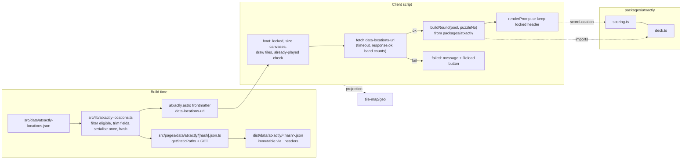

# refactor: Extract ATXactly game logic to a package and fetch its data

## Overview

`/labs/atxactly` is a 2,036-line single-file page whose inline script carries
the scoring curve, the seeded deck shuffle, a third copy of the Web Mercator
projection, and a tile loader, none of it unit-testable. The frontmatter also
serialises the whole 337-row location dataset into a `data-locations` attribute,
so every visit downloads a 415 KB HTML document that must be parsed before the
20 KB game script can run.

This plan moves the pure game logic into a new `packages/atxactly` workspace
with bare-bones Vitest specs that pin today's behaviour, points the page at
`tile-map/geo` for projection, and serves the dataset as a content-hashed JSON
file emitted at build time and fetched by the client. Gameplay does not change:
the same `puzzleNo` yields the same five locations, and the same guess yields
the same score.

## Problem Frame

Issue #32 consolidates three findings from the 2026-09-17 repo review pass
(architecture, TypeScript, simplicity, and performance reviewers):

- A regression in scoring or the deck only shows up as "today's puzzle repeated"
  or "the curve feels off". The location pipeline already had one silent
  geometry corruption caught only in review
  (`docs/reviews/2026-08-31-001-feat-22-austin-maptapp-location-pipeline-review.md`),
  which is the argument for tests on exactly this code. That review's Testing
  section already recommended extracting the scoring to a module with Vitest.
- The page duplicates projection math that `packages/tile-map` exports and
  tests.
- The built page is 415 KB against 40 KB for the structurally similar pogo map;
  the data is not independently cacheable and blocks script start.

`scripts/atxactly_scoring.py` is an intentional Python mirror of the TS scoring
and is the cross-check for the extracted tests. It has drifted once before
(wrong `MULTIPLIERS`, fixed in the August review), so parity is re-verified
during this work rather than assumed.

## Requirements Trace

- R1. A `packages/atxactly` workspace exposing pure `scoring` and `deck` modules
  with Vitest specs, mirroring the shape of `packages/tile-map` and
  `packages/weed-whacker` (exports to `.ts` source, identical strict tsconfig,
  `test` and `typecheck` scripts, root `file:` dependency).
- R2. Specs pin current behaviour before any math is touched: the score curve's
  endpoints and its continuity at `EDGE_OFFSET`, the deck's 1-1-2-2-3 difficulty
  shape, determinism for a given day, and the no-repeat-within-a-deal invariant
  that today lives only in a comment.
- R3. The page imports `lonToX`, `latToY`, `xToLon`, `yToLat`, and `TILE_SIZE`
  from `tile-map/geo` and drops its own copies.
- R4. The location dataset leaves the HTML. It is served as a cacheable JSON
  asset (immutable caching, hashed URL) fetched at runtime; the HTML shell lands
  well under 100 KB.
- R5. Behaviour unchanged: same daily puzzle for a given `puzzleNo`, same score
  for the same guess, same reveal drawing of polygon shapes, same practice-round
  and already-played semantics.
- R6. Where the page keeps its own map runtime, `CLAUDE.md` says so, so
  `tile-map` is not assumed to be the single source of truth for tiles.

## Scope Boundaries

- No polygon simplification. `scripts/build_atxactly_locations.py` already runs
  Ramer-Douglas-Peucker at `SIMPLIFY_EPS = 0.00025` (about 25 m), backs the
  tolerance off until each ring still contains its own point, and rounds
  coordinates to 5 decimals. Shapes are used for scoring at every difficulty
  band and are drawn at reveal, so any further simplification changes scores and
  is out of scope.
- The page keeps its own tile loader, camera, and canvas drawing. See Key
  Technical Decisions.
- No change to the scoring or deck math itself, including `haversine` with its
  `R = 6371008.8`. `tile-map`'s `haversineMeters` uses `R = 6371000` and is not
  a drop-in.
- The pre-existing bfcache case where `puzzleNo` computed before midnight UTC
  survives a back-navigation after midnight is not addressed here. It exists
  today and is independent of the data source.
- No changes to `scripts/build_atxactly_locations.py`, the JSON's location on
  disk, or its Prettier formatting. The pipeline keeps writing
  `src/data/atxactly-locations.json`.
- No new tests for DOM wiring, tiles, or drawing. Bare-bones specs on the pure
  modules only.

## Context & Research

### Relevant Code and Patterns

- `/Users/hfritz/Misc/itshagennothagen/src/pages/labs/atxactly.astro`: the
  extraction target. Frontmatter (top 28 lines) imports the JSON, filters to
  `status === 'eligible'`, and reads `PUBLIC_CARTO_API_KEY`. The `<script>`
  starts near line 655 and already imports attribution strings from `tile-map`.
  Inside: a second `Loc` type (narrower than the frontmatter's),
  `ALL = JSON.parse(root.dataset.locations!)`, `TILE = 256`, `MULTIPLIERS`,
  `MAX_TOTAL`, `BOX`, the four projection helpers, scoring (`haversine`,
  `pointInRing`, `distToSegment`, `effectiveDistance`, `reachOf`, `scoreInside`,
  `scoreOf`, `scoreLocation`, constants `FLOOR`, `MAXD`, `INSIDE_EDGE`,
  `EDGE_OFFSET`), deck (`mulberry`, `shuffled`, `deckFor`, `drawFrom`,
  `buildRound`, which closes over `ALL`), `puzzleNo` from the UTC date,
  `let ROUND = buildRound(puzzleNo)` at module top, the tile loader (`getTile`
  with `dark_nolabels` and `dark_all` layers, Esri and OSM fallbacks), camera
  (`minZoom`, `clampCamera`, `project`, `unproject`), drawing (`drawTiles`,
  `shapePath`, `drawOverlay`), `reset(seed)` which rebuilds `ROUND`, and the
  startup tail: `fit()`, `syncZoomButtons()`, then `showAlreadyPlayed()` or
  `renderPrompt()` depending on `localStorage['atxactly.lastPlayed']`. Grep the
  names; line numbers drift.
- `/Users/hfritz/Misc/itshagennothagen/src/data/atxactly-locations.json`: 369
  rows (337 eligible, 32 shortlist), 273 eligible rows carry `shape`. Trimmed to
  eligible rows and the fields the client uses, minified: 280 KB, 84 KB gzipped.
  Today's attribute payload is 340 KB before HTML escaping.
- `/Users/hfritz/Misc/itshagennothagen/packages/tile-map/`: the package shape to
  copy (`package.json` with `exports` to `.ts`, standalone strict
  `tsconfig.json`, colocated `*.test.ts`, no vitest config). Its
  `src/geo/projection.ts` exports `TILE_SIZE` and the four helpers with formulas
  identical to the page's.
- `/Users/hfritz/Misc/itshagennothagen/packages/weed-whacker/`: second instance
  of the same package shape; `src/core/rng.test.ts` is the closest precedent for
  testing a seeded PRNG.
- `/Users/hfritz/Misc/itshagennothagen/package.json`:
  `workspaces: ["packages/*"]`, `file:` dependencies per package, `test` and
  `typecheck` scripts fan out with `--workspaces --if-present`. CI runs
  `npm ci`, so the lockfile must be regenerated when the dependency is added.
- `/Users/hfritz/Misc/itshagennothagen/src/pages/rss.xml.ts`: the repo's only
  static endpoint (a `GET` export).
  `/Users/hfritz/Misc/itshagennothagen/src/pages/roadtrips/[slug].astro` is the
  `getStaticPaths` precedent.
- `/Users/hfritz/Misc/itshagennothagen/public/_headers`: only `/_astro/*` gets
  `Cache-Control: public, max-age=31536000, immutable`. A new path needs its own
  stanza.
- `/Users/hfritz/Misc/itshagennothagen/src/pages/labs/playlists.astro`: the
  `fetch` with `AbortSignal.timeout` precedent.
- `/Users/hfritz/Misc/itshagennothagen/src/layouts/Base.astro`: has a single
  default slot and no head slot today.
- `/Users/hfritz/Misc/itshagennothagen/scripts/atxactly_scoring.py`: Python
  mirror. Constants and formulas match the TS exactly; its docstring points at
  the `.astro` file and must move with the code. It has no deck logic.
- `/Users/hfritz/Misc/itshagennothagen/public/_redirects`: `/atxactly` 301,
  unaffected.

### Institutional Learnings

- `docs/plans/2026-09-16-001-feat-roadtrips-map-pages-plan.md` verified that a
  `file:` workspace package imports from Astro frontmatter and client scripts
  with no Vite config, because the symlinked dependency is treated as source.
  `astro check` resolves types through the `exports` map. Escape hatch if it
  ever breaks: `vite.ssr.noExternal` in `astro.config.mjs`.
- The August review recorded the baseline this work must preserve: TS and Python
  scoring agreed on 600 samples, and 365 simulated days produced no
  nondeterminism, no in-round duplicates, and the 1-1-2-2-3 shape every day.
- `docs/handoff/2026-08-30-001-atxactly-gameplay-polish.md`: verify visual
  changes in a real browser; several bugs looked correct in source. Keyless or
  wrong-parameter CARTO requests return watermarked tiles with HTTP 200.

### External References

- None. Local patterns cover the package shape; Astro static endpoints with
  `getStaticPaths` and Vite asset hashing are standard, well-documented
  behaviour for the pinned versions (Astro 6.4, Vite 7.3).

## Key Technical Decisions

- **Scoring and deck move verbatim; only their inputs change.** `buildRound`
  gains a `pool` parameter instead of closing over `ALL`; everything else keeps
  its exact arithmetic and loop structure so floating-point results are
  bit-identical. The specs' expected literals are captured from the existing
  inline code before it is deleted (characterization first), then cross-checked
  against the Python mirror for scoring.
- **`haversine` stays in the package.** `tile-map`'s `haversineMeters` uses a
  different Earth radius; substituting it would shift every distance and break
  parity with the Python mirror. Projection is the only thing borrowed from
  `tile-map/geo`.
- **The page keeps its own map runtime.** `createTileMap` takes one tile source;
  ATXactly swaps between `dark_nolabels` during play and `dark_all` at reveal,
  brightens tiles with a CSS filter, falls back to two different providers per
  layer, and drives a tuned reveal animation and zoom-button behaviour on top of
  its camera. Porting that onto `tile-map` is a behaviour risk with no test net
  and is not what the issue asks for. `CLAUDE.md` states the split: projection
  and game logic shared, tiles and camera page-owned.
- **Dataset delivery: an Astro static endpoint at a content-hashed path.** A
  shared build-time module trims the JSON to eligible rows and client fields,
  serialises it once, and derives an 8-character SHA-256 prefix. The endpoint
  `src/pages/data/atxactly/[hash].json.ts` emits the body at that path via
  `getStaticPaths`; the page reads the same module to write the URL into a
  `data-locations-url` attribute. `public/_headers` gains an immutable rule for
  `/data/*`. Rejected alternatives: a `?url` import of the raw JSON ships the
  file verbatim, so all 369 rows including the 32 shortlist entries and their
  `notes` go with it (115 KB the page never reads, and content not published
  today), with no trim step possible; a file in `public/` is unhashed, so it
  either caches stale data or forgoes the immutable header, and it would fork
  the pipeline's output path; a custom Vite plugin calling `emitFile` with the
  trimmed body would get Vite's hashing and the existing `/_astro/*` header for
  free, but it is plugin-authoring machinery registered in `astro.config.mjs`
  with no precedent here, where a static endpoint has two.
- **Stale-hash policy: reload, not retry.** After a deploy, HTML cached by a
  player points at a hash the new build no longer emits. The failure state's
  single action is a reload, which fetches fresh HTML and the new hash. No
  automatic retry loop.
- **Boot as an explicit phase.** The client script starts with `locked = true`
  and `idle = true`, sizes the canvases and draws tiles synchronously, runs the
  already-played check immediately (it depends only on the UTC date), and only
  after the fetch resolves builds the round and either leaves the locked header
  in place or renders the prompt. A single phase variable
  (`booting | ready | failed`) makes the already-played header and the live
  prompt mutually exclusive rather than relying on statement order.
- **Boundary validation is minimal.** After `response.ok`, the payload must be a
  non-empty array whose difficulty bands hold at least 2, 2, and 1 rows.
  Anything else is the failed phase, never an empty round, because `drawFrom` on
  an empty pool returns an empty array and the crash would surface three frames
  later in `renderPrompt`.
- **One `Location` type.** The shared module exports the trimmed client type
  (`difficulty: number`, `story: string`, no `status`, `tier`, `source`,
  `sourceRef`, `storySource`, or `notes`). The filter step narrows the raw rows
  to it; the page's `<script>` imports the type only. This retires the two
  divergent `Loc` declarations in the page. `packages/atxactly` never imports
  this type: its functions are typed structurally (`{ lat, lon, shape? }` for
  scoring, anything with a numeric `difficulty` for the deck), so the dependency
  runs site to package and the package stays free of the raw JSON's shape and of
  Node APIs.

## Open Questions

### Resolved During Planning

- Adopt `tile-map`'s runtime for tiles and camera? No, see Key Technical
  Decisions. Projection only.
- Simplify polygons at build? No. The pipeline already does, at a tolerance
  tuned so every ring still contains its own point, and shapes are needed at
  every tier for both scoring and reveal drawing.
- Should the deck spec pin against the real dataset? No. Adding a location
  legitimately changes every deck, so a real-data pin would break on every
  content edit. Pins use a small synthetic pool whose expected draws are
  captured from the current code. The invariants (shape, determinism, no-repeat
  within a deal) hold on any pool.
- Where does the eligible filter live? In the shared module, since the page
  frontmatter's only use of it was the attribute being removed.

### Deferred to Implementation

- Exact shape of the async boot: a `start()` function versus top-level `await`
  in the module script. Either satisfies the plan; the worker picks whichever
  leaves the existing handler registrations untouched.
- Whether `ROUND` is declared as an empty array or nullable while booting;
  driven by what `astro check` accepts with the least churn.
- Whether to keep the `<link rel="preload" as="fetch">` for the data URL at all.
  It is a pure optimisation that needs a one-line head slot in `Base.astro`; if
  the slot or the immediate-child constraint complicates the page, dropping the
  preload is a legitimate scope call. Its credentials pairing is not an unknown:
  see Unit 4.
- Non-null assertions versus restructuring under `noUncheckedIndexedAccess` for
  ring indexing in `pointInRing` and `effectiveDistance`. `tile-map` uses `!`
  where the index is provably in range; match it.

## High-Level Technical Design

> _This illustrates the intended approach and is directional guidance for
> review, not implementation specification. The implementing agent should treat
> it as context, not code to reproduce._

## Implementation Units

- [x] **Unit 1: Create `packages/atxactly` with scoring and deck modules and
      specs**

**Goal:** A pure, tested workspace package holding the game math, with the
current behaviour pinned.

**Requirements:** R1, R2

**Dependencies:** None

**Files:**

- Create: `packages/atxactly/package.json`
- Create: `packages/atxactly/tsconfig.json`
- Create: `packages/atxactly/src/index.ts`
- Create: `packages/atxactly/src/scoring.ts`
- Create: `packages/atxactly/src/deck.ts`
- Test: `packages/atxactly/src/scoring.test.ts`
- Test: `packages/atxactly/src/deck.test.ts`
- Modify: `package.json` (root; add the `file:` dependency)
- Modify: `package-lock.json` (regenerated by `npm install`)

**Approach:**

- Copy `package.json` and `tsconfig.json` from `packages/tile-map` verbatim,
  changing only the name and the `exports` map (a single `.` entry).
- `scoring.ts` carries `FLOOR`, `MAXD`, `INSIDE_EDGE`, `EDGE_OFFSET`,
  `haversine`, `pointInRing`, `distToSegment`, `effectiveDistance`, `reachOf`,
  `scoreInside`, `scoreOf`, `scoreLocation`, and `MULTIPLIERS`, typed against a
  minimal `{ lat, lon, shape? }` input so the package does not depend on the
  page's `Location` type. Export the constants the page or tests need.
- `deck.ts` carries `mulberry`, `shuffled`, `deckFor`, `drawFrom`, and
  `buildRound(pool, day)`, generic over anything with a numeric `difficulty`.
  Keep the existing comments that document the cycle invariant; they are the
  only spec that existed. `puzzleNo` (the UTC day number) and `MAX_TOTAL` stay
  in the page: one is scheduling, the other is display, and neither feeds the
  math.
- Do not change any arithmetic, rounding, or loop order. The point of this unit
  is a move, not an edit.
- Before deleting anything from the page, capture expected values by running the
  current inline functions (copied into a scratch script) on the test fixtures,
  and confirm the scoring values against `scripts/atxactly_scoring.py` on the
  same inputs.

**Execution note:** Characterization first. Expected literals in the specs come
from the existing code, not from the new module.

**Patterns to follow:**

- `packages/tile-map/package.json`, `packages/tile-map/tsconfig.json`
- `packages/tile-map/src/geo/projection.test.ts` for test style (`describe`,
  `it`, `toBeCloseTo` for floats)
- `packages/weed-whacker/src/core/rng.test.ts` for seeded-PRNG testing

**Test scenarios:**

- `scoreOf` returns 100 at and below `FLOOR`, 0 at and above `MAXD`, and the
  pinned value at 1 km (cross-checked with the Python `score_distance`).
- Continuity at the boundary of a small square polygon: a guess just inside the
  edge scores about `INSIDE_EDGE`, a guess 1 m outside scores about the same,
  and a guess at the stored centre scores 100.
- `pointInRing` classifies one inside and one outside point of the same square.
- `buildRound` on a synthetic pool returns five rows with difficulties 1, 1, 2,
  2, 3, and is identical across two calls for the same day.
- Pinned draws for the synthetic pool on two different days match the literals
  captured from the current code.
- For one band, the union of draws across a full deal-through has no repeated
  id.

**Verification:**

- `npm test` and `npm run typecheck` from the root pick up the new workspace
  without CI changes and pass.
- `npm ci` succeeds with the regenerated lockfile.
- Prettier is clean on the new files.

- [x] **Unit 2: Rewire the page onto the package and `tile-map/geo`**

**Goal:** The page's inline script imports scoring, deck, and projection instead
of defining them, with no behaviour change.

**Requirements:** R3, R5

**Dependencies:** Unit 1

**Files:**

- Modify: `src/pages/labs/atxactly.astro`

**Approach:**

- Delete the inline projection helpers and `TILE`; import `lonToX`, `latToY`,
  `xToLon`, `yToLat`, `TILE_SIZE` from `tile-map/geo` and use `TILE_SIZE` where
  `TILE` was used for tile stepping.
- Delete the inline scoring and deck functions and constants; import from
  `atxactly`. `buildRound(ALL, seed)` replaces the closure at both call sites
  (module top and `reset`).
- Leave the tile loader, camera, drawing, and DOM wiring untouched.

**Patterns to follow:**

- `src/pages/labs/austin-pogo-map.astro` client script for bare-specifier
  imports from a workspace package.

**Test scenarios:**

- None new. The package specs cover the moved code.

**Verification:**

- `astro check` passes on the page.
- Played in a browser: a guess produces the same score toast as before for the
  same tap; the reveal still draws polygon fills; tiles and zoom behave as
  before.
- The built page's script chunk shrinks by roughly the size of the removed
  functions.

- [x] **Unit 3: Emit the location dataset as a hashed JSON endpoint**

**Goal:** The trimmed dataset is a separate, immutable, content-addressed build
output.

**Requirements:** R4

**Dependencies:** None (can land before or after Unit 2)

**Files:**

- Create: `src/lib/atxactly-locations.ts`
- Create: `src/pages/data/atxactly/[hash].json.ts`
- Modify: `public/_headers`

**Approach:**

- The lib module imports the raw JSON, filters `status === 'eligible'`, keeps
  exactly the fields the client `Location` type declares, serialises once with
  no whitespace, hashes the body with `node:crypto`, and exports the `Location`
  type, the body, the hash, and the public URL. This is build-time code and may
  use Node APIs; the client script imports only the type from it.
- The module must be pure and deterministic at top level (no timestamps, no
  randomness, no in-place mutation of the imported JSON; trim into new objects).
  Vite normally evaluates it once per build, but the page and the endpoint are
  separate render passes, and determinism is what guarantees they agree on the
  hash even if it runs twice. Module-level constants are the memoization; do not
  add a cache.
- The endpoint's `getStaticPaths` returns the one hash (the `params` key must
  match the bracket name); its `GET` returns the body with a JSON content type.
  No `prerender` export is needed under static output. Astro writes endpoint
  output as a bare file, never a directory with an index, regardless of
  `build.format`, and Cloudflare derives `Content-Type` from the `.json`
  extension at upload; the header set in `GET` matters only under `astro dev`.
- `_headers` gets a `/data/*` stanza copying the `/_astro/*` cache rule.

**Patterns to follow:**

- `src/pages/rss.xml.ts` for a static endpoint's `GET` export
- `src/pages/roadtrips/[slug].astro` for `getStaticPaths`

**Test scenarios:**

- None automated. Build output is the check.

**Verification:**

- `npm run build` writes `dist/data/atxactly/<hash>.json` containing 337 rows
  and no `status`, `tier`, `source`, or `notes` fields, at about 280 KB.
- `dist/_headers` carries the new stanza.
- Editing one location and rebuilding changes the hash.

- [x] **Unit 4: Fetch the dataset at runtime with an explicit boot phase**

**Goal:** The page stops inlining data, loads it asynchronously without any
window where a tap can score or a wrong round can render, and shows a
recoverable failure state.

**Requirements:** R4, R5

**Dependencies:** Units 2 and 3

**Files:**

- Modify: `src/pages/labs/atxactly.astro`
- Modify: `src/layouts/Base.astro` (head slot for the preload, if kept)

**Approach:**

- Frontmatter imports the lib module and writes `data-locations-url`; the
  `data-locations` attribute and the frontmatter `Loc` type and filter go away.
  `data-carto-key` stays.
- Client script: `locked` and `idle` start true; `ROUND` starts empty. Canvas
  sizing, `syncZoomButtons`, tile drawing, and all handler registrations stay
  synchronous. The already-played check runs immediately, before the fetch,
  since it depends only on `puzzleNo`; its Practice button stays hidden until
  data is ready.
- Fetch the URL with `AbortSignal.timeout` (10 s), check `response.ok`, validate
  array and band counts, then set `ALL`, build the round, and either leave the
  locked already-played header as is or `renderPrompt()` and release `locked`.
- Failure (network, timeout, non-OK, bad shape): header name reads that the
  puzzle could not load, subtitle asks to reload, and the existing `#mt-again`
  button is shown with a reload label whose handler reloads the page. `locked`
  stays true. A 404 after a deploy lands here and the reload fixes it.
- The static `#mt-sub` text becomes neutral (it currently says "Tap as close as
  you can" before any round exists); `renderPrompt` already sets the real
  subtitle.
- Add a `<link rel="preload" as="fetch" crossorigin>` for the data URL so the
  fetch starts alongside the script download. Preload matching keys on
  credentials mode even for same-origin requests (MDN, `rel=preload`), so the
  link and the fetch must be a matched pair: `crossorigin` on the link means the
  fetch passes `credentials: 'omit'`. A bare `fetch(url)` defaults to
  `same-origin` and would download the file twice. This needs a named head slot
  in `Base.astro`, and Astro does not hoist `<link>` tags, so the page's link
  must be an immediate child of the layout component carrying the slot name, not
  nested in a wrapper.

**Patterns to follow:**

- `src/pages/labs/playlists.astro` for the `fetch` timeout signal.
- `showAlreadyPlayed()` in the page for how a locked header hides the multiplier
  and category and repurposes `#mt-again`.

**Test scenarios:**

- None automated. Browser checks below.

**Verification:**

- `dist/labs/atxactly/index.html` is well under 100 KB and contains no
  `data-locations=` attribute.
- Cold load: tiles appear before the puzzle name; a tap during loading does
  nothing; the first prompt then renders and play proceeds exactly as before.
- Already-played today: the locked header appears immediately, no prompt ever
  flashes over it, and the Practice button works once data has landed.
- Failure path, forced by pointing the URL at a missing hash: the header shows
  the failure text and the reload button, the map still pans and zooms, no
  console exception from `renderPrompt`.
- Second visit: the JSON is served from cache (immutable) with no revalidation
  request.
- Cold load makes exactly one request for the data URL (the preload is consumed
  by the fetch).

- [ ] **Unit 5: Update docs and the Python mirror's pointer**

**Goal:** Repo documentation reflects the new package and data path.

**Requirements:** R6

**Dependencies:** Units 1 to 4

**Files:**

- Modify: `CLAUDE.md`
- Modify: `README.md`
- Modify: `scripts/atxactly_scoring.py` (docstring path only)

**Approach:**

- `CLAUDE.md` Stack: add `packages/atxactly` (pure scoring and deck, consumed by
  `/labs/atxactly`), replace the sentence that atxactly keeps its own inline map
  code with the precise split (projection from `tile-map/geo`, game logic from
  `packages/atxactly`, tiles and camera page-owned). Say why in one sentence:
  the page needs two swappable basemap layers, per-layer fallback providers, and
  a CSS brightness filter that `createTileMap` does not offer, so `tile-map` is
  the source of truth for tiles only where a page needs one layer with one
  fallback. Note that the dataset is emitted at `/data/atxactly/<hash>.json` by
  a static endpoint with immutable caching.
- `README.md`: mention the new package where the other two are listed.
- The Python docstring points at `packages/atxactly/src/scoring.ts` and keeps
  the "change both together" instruction.
- No em dashes anywhere in these edits.

**Patterns to follow:**

- Existing `CLAUDE.md` bullets for `packages/tile-map` and `/roadtrips`.

**Test scenarios:**

- None.

**Verification:**

- Prettier clean; `CLAUDE.md` accurately names the files that exist after Units
  1 to 4.

## System-Wide Impact

- **Interaction graph:** `reset(seed)` and the module-top round build are the
  only callers of `buildRound`; both change to pass the pool. `shapePath`,
  `drawOverlay`, and the reveal animation read `loc.shape` from the fetched
  rows, so the trimmed payload must keep `shape` intact. `sampleHeader()` for
  the help overlay only samples when `idle` or `finished` is set, which is why
  `idle` starts true during boot.
- **Error propagation:** Fetch, timeout, non-OK, and malformed payloads all
  resolve to one failed phase with a reload action. Nothing else in the page
  throws on missing data because `locked` gates `commit()` and the Practice
  button is hidden until data is ready.
- **State lifecycle risks:** The already-played `localStorage` key is written
  only when a daily round finishes, unchanged. A deploy invalidates the hashed
  URL for players holding stale HTML; the reload policy handles it. The
  immutable cache means a data edit must change the hash, which the content hash
  guarantees.
- **API surface parity:** `scripts/atxactly_scoring.py` remains the Python
  mirror of `scoring.ts`; the deck has no mirror and none is added. The
  `/atxactly` redirect and `SHARE_URL` are untouched.
- **Integration coverage:** No automated test covers the page. The browser
  checks in Unit 4 are the integration gate, run against the built output with
  the CARTO key present.

## Risks & Dependencies

- Strict tsconfig friction: `noUncheckedIndexedAccess` turns `ring[i]` into a
  possibly-undefined type. Non-null assertions where the index is in range match
  `tile-map`; do not restructure loops, which could perturb evaluation order.
- Lockfile: CI runs `npm ci`, so forgetting to regenerate `package-lock.json`
  fails the build step.
- `astro check` on a page importing a new workspace package: proven for
  `tile-map`, same mechanism, low risk.
- Endpoint output path and content type: confirmed against the pinned Astro
  6.4.8 build code (endpoints write a bare file) and Cloudflare's docs
  (extension-derived `Content-Type`), so neither is a build-time discovery. The
  `/data/*` header stanza must not shadow anything else (nothing lives under
  `/data/` today).
- Preload credentials mismatch causes a duplicate download. Unit 4 specifies the
  matched pair; the Network panel check verifies one request, it does not
  diagnose.

## Documentation / Operational Notes

- `CLAUDE.md` and `README.md` updates are Unit 5.
- Production check after merge: `/labs/atxactly` HTML size, the `Cache-Control`
  on `/data/atxactly/<hash>.json`, and that a play-through matches a pre-merge
  score for the same taps (compare against a preview deploy of the same day).
- Adding locations is unchanged for the author: edit the JSON (or run the
  pipeline), rebuild, and the hash rolls.

## Sources & References

- Related issue: #32
- Related code: `src/pages/labs/atxactly.astro`, `packages/tile-map/src/geo/`,
  `scripts/atxactly_scoring.py`, `scripts/build_atxactly_locations.py`
- Prior review:
  `docs/reviews/2026-08-31-001-feat-22-austin-maptapp-location-pipeline-review.md`
- Prior plan: `docs/plans/2026-09-16-001-feat-roadtrips-map-pages-plan.md`
- Handoffs: `docs/handoff/2026-09-18-001-atxactly-extraction-next.md`,
  `docs/handoff/2026-08-30-001-atxactly-gameplay-polish.md`
- Requirements history:
  `docs/brainstorms/2026-08-11-001-atxactly-requirements.md` (stale on backend
  and identity; scoring and difficulty sections still apply)
